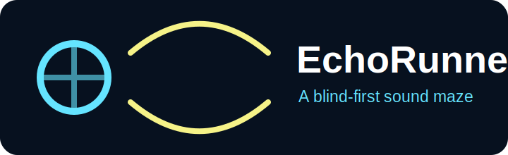
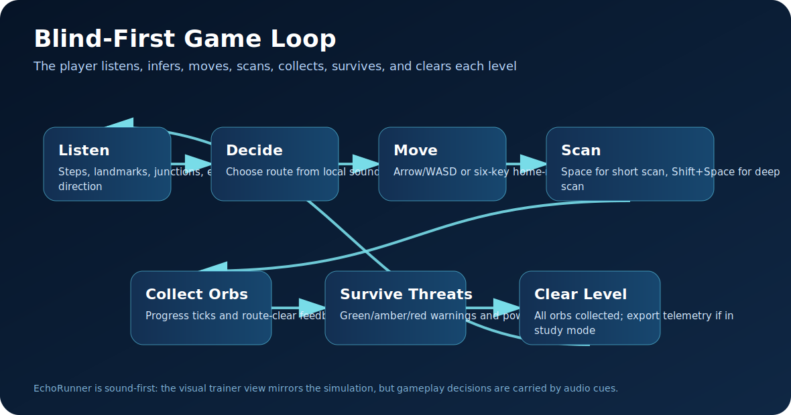
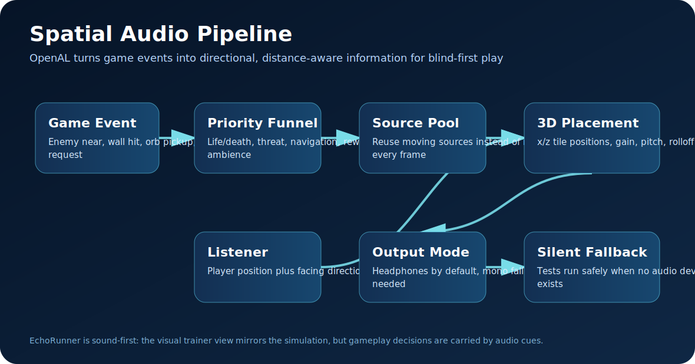
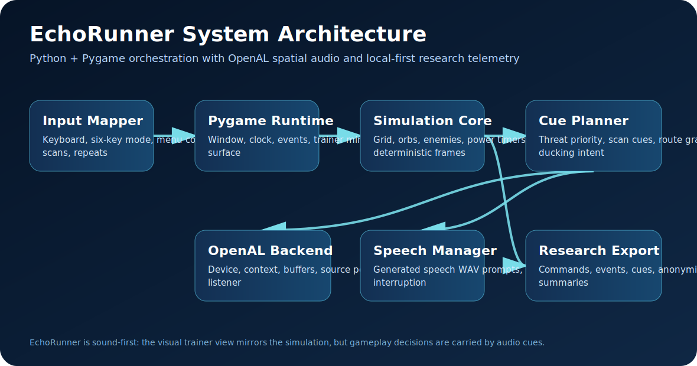

<p align="center">
  
</p>

<h1 align="center">EchoRunner</h1>

<p align="center">
  <strong>A blind-first sound-maze chase game built with Python, Pygame, and OpenAL spatial audio.</strong>
</p>

<p align="center">
  
  
  
  
  
</p>

---

## What is EchoRunner?

**EchoRunner** is an original, accessibility-first maze chase game where the main interface is **sound**. The player moves through a maze, collects echo orbs, avoids enemies, uses temporary power states, and learns the level through spatial audio, short speech prompts, rhythm, and memory.

This project is not a normal visual game with audio added later. It is designed from the beginning for blind and visually impaired players:

- **Gameplay is driven by audio cues**, not visual sprites.
- **Pygame** handles the window, keyboard input, game loop, and trainer mirror view.
- **OpenAL / OpenAL Soft** handles positional sound, listener orientation, source movement, attenuation, and cue priority.
- **Generated speech WAV files** introduce the game, controls, tutorial modules, help, calibration, and accessibility options.
- **A visual trainer view** lets a sighted teacher, researcher, or family member understand what is happening without becoming required for play.
- **Local-first telemetry** supports HCI/user-study testing without depending on cloud services.

<p align="center">
  
</p>

---

## Project goal

EchoRunner aims to become a playable research-grade prototype for blind-accessible real-time games. The target experience is:

- A blind player can launch the game, hear the onboarding, calibrate audio, complete the tutorial, and play using only keyboard and sound.
- A sighted trainer can open a mirror view to support teaching and debugging.
- Developers can test the simulation in headless mode.
- Researchers can run local HCI study sessions and export anonymized results.

The design goal is **skill, tension, agency, and replayability**, not pity accessibility.

---

## Core features

### Blind-first gameplay

- Maze chase loop:
  - listen to the maze state
  - choose a direction
  - move through corridors
  - collect echo orbs
  - avoid enemies
  - activate resonance cores
  - clear the level
- Audio-first route learning through:
  - movement ticks
  - wall knocks
  - junction direction cues
  - spatial enemy warnings
  - power countdowns
  - level-clear feedback
- Optional scan behavior:
  - short scan for immediate useful information
  - deep scan for broader route planning

### Spatial and directional audio

- OpenAL device/context initialization.
- OpenAL buffer loading from WAV files.
- Source pooling for many short game cues.
- Listener position and orientation updated from player state.
- Spatial enemy cues placed around the player using grid-derived coordinates.
- Mono fallback mode for users without headphones or with asymmetric hearing needs.
- Silent fallback mode for automated tests or headless environments with no audio device.

<p align="center">
  
</p>

### Accessibility systems

- Keyboard-only operation.
- Arrow-key and WASD movement.
- Six-key home-row layout support in code.
- Repeat-last-speech support.
- Audio calibration flow.
- Cue-density setting concept: beginner, standard, expert.
- Low-stress mode setting concept.
- High-contrast trainer view concept.
- Speech files for onboarding, tutorial, controls, help, and settings.

### Trainer and research support

- Visual trainer mirror for sighted helpers.
- Telemetry logging for commands, state transitions, cues, threats, confusion markers, and outcomes.
- Local session folders.
- Anonymized export command.
- HCI study templates and schemas in `studyKit/`.
- Headless simulation bots for QA and balancing.

<p align="center">
  
</p>

---

## Repository structure

```text
EchoRunner/
├── src/echorunner/                 # Main Python package
│   ├── app.py                      # App state machine and Pygame loop
│   ├── main.py                     # CLI entry point
│   ├── audio/                      # OpenAL backend and speech manager
│   ├── bot/                        # Headless simulation bots
│   ├── cues/                       # Audio cue planning and priority logic
│   ├── input/                      # Keyboard-to-command mapping
│   ├── research/                   # Study/session export helpers
│   ├── simulation/                 # Deterministic game logic
│   ├── telemetry/                  # Local event logging
│   └── trainer_view/               # Sighted trainer mirror renderer
├── assetLibrary/                   # Original placeholder visual assets
│   ├── sprites/                    # Player, enemies, orbs, power cores
│   ├── tiles/                      # Wall, corridor, pellet, power, junction tiles
│   ├── ui/                         # Accessibility and UI icons
│   ├── backgrounds/                # Sonar/grid backgrounds
│   └── title/                      # EchoRunner logo
├── soundLibrary/                   # SFX and generated speech audio
│   ├── wav/                        # Gameplay SFX WAV files
│   ├── speech/en/                  # English speech txt + wav files
│   ├── speech/bn/                  # Bangla draft speech txt + wav files
│   ├── manifest.json               # SFX manifest
│   └── speech_manifest.json        # Speech manifest
├── levels/                         # Starter level JSON files
├── config/                         # Defaults, audio profiles, keybindings
├── docs/                           # Implementation workplan documents
├── docs/images/                    # README diagrams
├── studyKit/                       # HCI consent/session templates and schemas
├── tests/                          # Unit/integration tests
├── scripts/                        # Setup, run, validation, packaging helpers
├── pyproject.toml                  # Python package metadata
└── README.md                       # This file
```

---

## Requirements

### Required

- **Python 3.11 or newer**
- **Pygame-CE 2.5+**
- **OpenAL Soft** or a compatible OpenAL runtime
- Headphones are strongly recommended for spatial play

### Python dependencies

Installed from `requirements.txt` or `pyproject.toml`:

- `pygame-ce`
- `numpy`
- `PyYAML`
- `pydantic`
- `rich`
- `platformdirs`
- `pytest` and `pytest-cov` for tests
- `pyinstaller` for desktop export builds

---

## Setup guide

### 1. Clone or unzip the project

```bash
cd path/to/your/workspace
# If using git:
git clone <your-repository-url> EchoRunner
cd EchoRunner
```

If you received the project as a ZIP, extract it and open a terminal inside the extracted `EchoRunner` folder.

---

### 2. Create a virtual environment

#### Linux / macOS

```bash
python3 -m venv .venv
source .venv/bin/activate
python -m pip install --upgrade pip
python -m pip install -r requirements.txt
python -m pip install --no-build-isolation -e .
```

Or use the helper script:

```bash
bash scripts/setup_venv.sh
```

#### Windows PowerShell

```powershell
py -3.11 -m venv .venv
.\.venv\Scripts\Activate.ps1
python -m pip install --upgrade pip
python -m pip install -r requirements.txt
python -m pip install --no-build-isolation -e .
```

Or use the helper script:

```powershell
.\scripts\setup_venv.ps1
```

If PowerShell blocks script execution, run PowerShell as the current user and use:

```powershell
Set-ExecutionPolicy -ExecutionPolicy RemoteSigned -Scope CurrentUser
```

Then run the setup script again.

---

### 3. Install or set up OpenAL Soft

EchoRunner uses OpenAL for real spatial/directional audio. Pygame is not used as the main spatial audio engine.

Run:

```bash
python scripts/setup_openal.py
```

The helper attempts to handle common platforms:

- **Windows**
  - Downloads or prepares the OpenAL Soft runtime when possible.
  - Places `OpenAL32.dll` where the game can load it.
- **Ubuntu/Debian Linux**
  - Uses packages such as `libopenal1` / `openal-soft` when available.
- **Fedora Linux**
  - Uses OpenAL Soft system packages when available.
- **macOS**
  - Uses Homebrew `openal-soft` when available.

Manual alternatives:

```bash
# Ubuntu/Debian
sudo apt-get update
sudo apt-get install libopenal1 libopenal-dev

# Fedora
sudo dnf install openal-soft openal-soft-devel

# macOS with Homebrew
brew install openal-soft
```

On Windows, install OpenAL Soft and make sure `OpenAL32.dll` is in either:

- the project root,
- the same directory as the built executable,
- or a folder available through `PATH`.

---

## How to run

### Run the game

```bash
python -m echorunner
```

Or, after editable install:

```bash
echorunner
```

Platform helper scripts:

```bash
# Linux/macOS
bash scripts/run_game.sh

# Windows CMD
scripts\run_game.bat

# Windows PowerShell
.\scripts\run_game.ps1
```

---

### Start directly in tutorial mode

```bash
python -m echorunner --tutorial
```

The tutorial introduces the player gradually:

- walls and movement
- junctions and open routes
- echo orbs
- scan behavior
- enemies and threat levels
- resonance cores/power mode
- final practice level

---

### Run the trainer/developer view

```bash
python -m echorunner --trainer
```

or:

```bash
python -m echorunner --dev
```

The trainer view is meant for:

- sighted teachers helping blind players,
- debugging level design,
- HCI observation sessions,
- checking enemy behavior and spatial cue timing.

The blind-player experience should still be complete without this view.

---

### Run audio QA suites

Spatial QA:

```bash
python -m echorunner --audio-test --suite spatial
```

Masking/ducking/mono QA:

```bash
python -m echorunner --audio-test --suite masking
```

Speech interruption QA:

```bash
python -m echorunner --audio-test --suite speech
```

These tests are useful after changing the audio engine, source-pool behavior, speech files, or cue priorities.

---

### Run headless simulation tests

Headless mode runs the deterministic simulation without the full game window/audio loop.

```bash
python -m echorunner --headless --level level_01_training_loop --bot safe_scan --runs 10
```

Available bot types:

- `wall_hugger`
- `random`
- `safe_scan`
- `perfect`

Use this for:

- checking if levels are solvable,
- comparing enemy pressure,
- catching simulation regressions,
- balancing early levels before user testing.

---

### Run study mode

```bash
python -m echorunner --study --participant P01 --level level_01_training_loop
```

Study mode is designed for HCI/accessibility testing. It creates local telemetry that can later be exported.

Export latest session:

```bash
python -m echorunner export --session latest
```

Export anonymized latest session:

```bash
python -m echorunner export --session latest --anonymized
```

Delete a session’s local telemetry:

```bash
python -m echorunner export --session <SESSION_ID> --delete
```

---

## Player controls

| Action | Primary keys | Alternate keys | Purpose |
|---|---:|---:|---|
| Move up | `Up` | `W` | Move or queue upward turn |
| Move down | `Down` | `S` | Move or queue downward turn |
| Move left | `Left` | `A` | Move or queue left turn |
| Move right | `Right` | `D` | Move or queue right turn |
| Confirm/select | `Enter` | Numpad Enter | Select menu item or confirm prompt |
| Back/pause | `Escape` | Backspace | Pause gameplay or go back in menus |
| Short scan | `Space` | Numpad 0 | Hear immediate useful surroundings |
| Deep scan | `Shift + Space` | `Tab` | Hear a broader route summary |
| Repeat last speech | `R` | `F5` | Replay the last spoken instruction |
| Help | `H` | `F1` | Speak contextual help |
| Audio calibration | `F2` | — | Start audio calibration |
| Cue density | `F3` | — | Cycle beginner/standard/expert cue density |
| Mark confusion | `F8` | — | Add a researcher/trainer marker to telemetry |
| Toggle trainer view | `F9` | — | Open/close sighted helper view |
| Mute music | `F10` | — | Reserved for ambience/music control |

### Six-key home-row control concept

The input mapper also contains a six-key layout concept for compact blind-friendly control:

| Key | Action |
|---:|---|
| `S` | Move left |
| `D` | Move up |
| `F` | Short scan |
| `J` | Confirm |
| `K` | Move down |
| `L` | Move right |

This layout is inspired by home-row tactile orientation and can be expanded into a formal accessibility setting.

---

## Game concepts

### Echo orbs

- Main collectibles.
- Every orb gives a short progress tick.
- Clearing all orbs completes the level.

### Resonance cores

- Temporary power state.
- The player can reverse danger for a short time.
- A countdown warning plays before power expires.

### Enemies

Enemy pressure is communicated through sound, not just screen position:

- **Green threat**: enemy is present, but not immediately dangerous.
- **Amber threat**: enemy may become dangerous soon.
- **Red threat**: immediate escape/turn/power action needed.
- **Frightened state**: power mode changes the meaning of enemy sounds.

Enemy archetypes can use different movement and audio personalities:

- hunter
- ambusher
- trickster
- coward

### Scanning

Scan is not a cheat. It is the blind-first equivalent of glancing at the maze.

- Short scan: quick local decision support.
- Deep scan: broader planning support.
- Good scans should answer questions like:
  - Where are open routes?
  - Where are orbs?
  - Where is danger?
  - Is there a power core nearby?

---

## OpenAL + Pygame architecture

EchoRunner deliberately separates visual/game-loop responsibility from spatial-audio responsibility.

### Pygame owns

- window creation
- keyboard input
- fixed-time game loop
- trainer mirror rendering
- event polling
- screen updates

### OpenAL owns

- audio device selection
- context creation
- buffer loading
- source playback
- source pooling
- listener position/orientation
- positional enemy sound
- distance attenuation
- gain/pitch/looping settings

### Why this separation matters

- Pygame’s mixer is useful for simple 2D sound but not enough for reliable directional gameplay.
- OpenAL maps naturally to the game model:
  - **listener** = player
  - **sources** = enemies, warnings, landmarks, speech, reward cues
  - **buffers** = WAV assets
  - **position** = grid-derived world coordinates
- Directional audio must be accurate because sound is gameplay.

---

## Asset and sound library

### Visual assets

`assetLibrary/` contains original placeholder assets for the current prototype:

- player sprite
- enemy sprites
- echo orb
- resonance core
- tile set
- UI/accessibility icons
- sonar-grid background
- EchoRunner title/logo SVG

These are meant for:

- trainer view,
- documentation,
- debugging,
- future packaging,
- GitHub visual presentation.

### Sound assets

`soundLibrary/wav/` contains gameplay SFX such as:

- movement step
- wall knock
- orb pickup
- enemy warnings
- power activation/countdown/expiry
- scan start/success
- level clear
- menu navigation
- trainer marker

### Speech assets

`soundLibrary/speech/` contains generated speech prompts:

- English TXT + WAV files
- Bangla draft TXT + WAV files
- onboarding
- controls
- tutorial modules
- gameplay help
- calibration
- settings prompts
- study-mode intro

The generated voices are good for implementation and testing. For a polished release, replace them with higher-quality TTS or human-recorded audio while keeping stable filenames and IDs.

---

## Testing and QA

Run all available automated tests:

```bash
python -m pytest -q
```

Run the project validation script:

```bash
bash scripts/run_tests.sh
```

The validation script checks:

- unit tests
- integration tests
- audio manifest consistency
- asset manifest consistency
- level JSON validity

Useful direct validators:

```bash
python scripts/validate_audio_manifest.py
python scripts/validate_assets.py
python scripts/validate_levels.py
```

Recommended QA layers:

- **Compile check**: confirms Python files import/compile.
- **Unit tests**: checks low-level rules and audio wrapper behavior.
- **Integration tests**: checks bigger flows such as app/audio/simulation interactions.
- **Headless bot tests**: checks level solvability and balance.
- **Manual audio QA**: validates left/right/front/back cues and masking.
- **Blind-player testing**: required before claiming the game is actually accessible.

---

## Packaging/export

EchoRunner includes `EchoRunner.spec` for PyInstaller-based export work.

Typical build command:

```bash
pyinstaller EchoRunner.spec
```

Before distributing builds, verify:

- OpenAL runtime is bundled or installed.
- `soundLibrary/` is included.
- `assetLibrary/` is included.
- `levels/` is included.
- speech WAV files are included.
- settings and telemetry write to user data folders, not the app bundle.
- audio QA succeeds on the target OS.

---

## Troubleshooting

### `ModuleNotFoundError: No module named 'echorunner'`

Run from the project root after installing editable mode:

```bash
python -m pip install --no-build-isolation -e .
python -m echorunner
```

### Pygame window does not open on Linux server/CI

Use headless simulation instead:

```bash
python -m echorunner --headless --bot safe_scan --runs 5
```

### No sound or OpenAL device error

Check OpenAL installation:

```bash
python scripts/setup_openal.py
```

Then run:

```bash
python -m echorunner --audio-test --suite spatial
```

If you are in a container, VM, or CI runner with no audio device, EchoRunner may use silent fallback so automated tests can still run. Real gameplay needs a working audio output device.

### Direction sounds wrong

- Use headphones.
- Run audio calibration.
- Confirm left/right are not swapped.
- Try mono mode if headphones are unavailable or spatial direction is confusing.

### Windows script does not run

Use PowerShell setup:

```powershell
Set-ExecutionPolicy -ExecutionPolicy RemoteSigned -Scope CurrentUser
.\scripts\setup_venv.ps1
.\scripts\run_game.ps1
```

### Assets or sounds missing

Run validators:

```bash
python scripts/validate_audio_manifest.py
python scripts/validate_assets.py
python scripts/validate_levels.py
```

---

## Development notes

- Keep gameplay logic deterministic where possible.
- Keep audio cue IDs stable after user testing begins.
- Add new sounds through the manifest, not hardcoded paths.
- Avoid long speech during real-time gameplay.
- Survival cues must override decorative sounds.
- New levels should teach one new difficulty variable at a time.
- Use telemetry markers to record confusion during testing.
- Do not claim accessibility success from sighted-only testing.

---

## Current implementation status

This codebase is an implementation prototype with working scaffolding for:

- Python package structure
- Pygame app loop
- OpenAL ctypes wrapper
- OpenAL source-pool backend
- generated sound and speech assets
- starter levels
- tutorial/menu state flow
- trainer view renderer
- deterministic simulation core
- headless bots
- HCI study/export helpers
- automated tests and validators

It is ready for deeper gameplay iteration, user testing, and accessibility refinement.

---

## License and asset note

This project uses original placeholder assets generated for EchoRunner prototyping. Replace placeholder speech and art before a public/commercial release if you need a more polished production identity.

---

## Quick command reference

```bash
# Setup
python -m venv .venv
source .venv/bin/activate          # Linux/macOS
python -m pip install -r requirements.txt
python -m pip install --no-build-isolation -e .
python scripts/setup_openal.py

# Run
python -m echorunner
python -m echorunner --tutorial
python -m echorunner --trainer

# Audio QA
python -m echorunner --audio-test --suite spatial
python -m echorunner --audio-test --suite masking
python -m echorunner --audio-test --suite speech

# Headless QA
python -m echorunner --headless --level level_01_training_loop --bot safe_scan --runs 10

# Study mode
python -m echorunner --study --participant P01 --level level_01_training_loop
python -m echorunner export --session latest --anonymized

# Tests
python -m pytest -q
bash scripts/run_tests.sh
```
