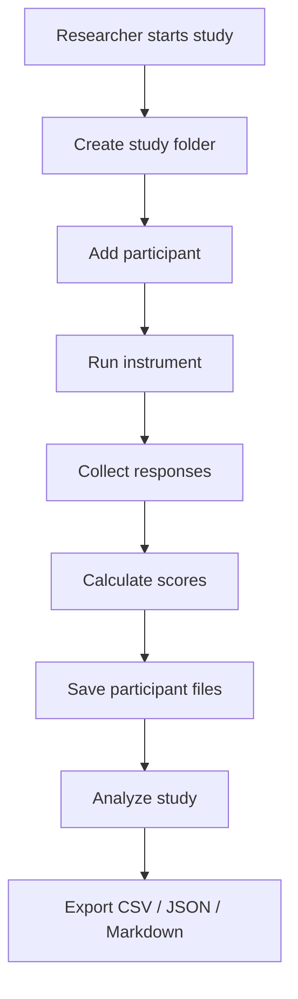
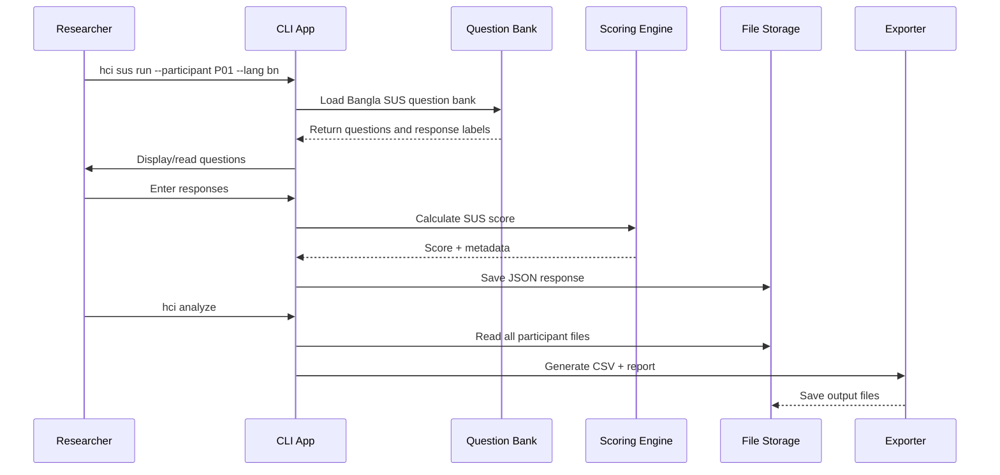

# hci-study-toolkit — Formal Project Documentation

**Project codename:** `hci-study-toolkit`  
**Tagline:** The user-study toolkit HCI researchers in the Global South actually need.  
**Document type:** Product + Technical + Research Documentation  
**Primary audience:** Development team, research collaborators, HCI students, maintainers  
**Version:** 1.0 draft  
**Recommended MVP timeline:** 3 weeks for core prototype, 8–12 weeks for mature research-grade release

---

## Table of Contents

1. [Executive Summary](#1-executive-summary)
2. [Project Vision](#2-project-vision)
3. [Problem Background](#3-problem-background)
4. [Basic HCI Concepts the Team Must Understand](#4-basic-hci-concepts-the-team-must-understand)
5. [What the Software Actually Does](#5-what-the-software-actually-does)
6. [Target Users](#6-target-users)
7. [Project Scope](#7-project-scope)
8. [Core Product Principles](#8-core-product-principles)
9. [Main Research Instruments](#9-main-research-instruments)
10. [System Overview](#10-system-overview)
11. [Recommended Technology Stack](#11-recommended-technology-stack)
12. [Repository Structure](#12-repository-structure)
13. [Core Data Flow](#13-core-data-flow)
14. [Data Storage Design](#14-data-storage-design)
15. [Functional Requirements](#15-functional-requirements)
16. [Non-Functional Requirements](#16-non-functional-requirements)
17. [CLI Command Specification](#17-cli-command-specification)
18. [User Experience Design](#18-user-experience-design)
19. [Accessibility Design](#19-accessibility-design)
20. [Bangla and Multilingual Design](#20-bangla-and-multilingual-design)
21. [Audio and TTS Design](#21-audio-and-tts-design)
22. [Research Ethics and Privacy](#22-research-ethics-and-privacy)
23. [Scoring Logic](#23-scoring-logic)
24. [Reporting and Export System](#24-reporting-and-export-system)
25. [Detailed Use Cases](#25-detailed-use-cases)
26. [Edge Cases and Error Handling](#26-edge-cases-and-error-handling)
27. [Testing Strategy](#27-testing-strategy)
28. [MVP Development Roadmap](#28-mvp-development-roadmap)
29. [Definition of Done](#29-definition-of-done)
30. [Future Extensions](#30-future-extensions)
31. [Appendix A: Sample Study Folder](#appendix-a-sample-study-folder)
32. [Appendix B: Sample Output Files](#appendix-b-sample-output-files)
33. [Appendix C: Sample README Opening](#appendix-c-sample-readme-opening)

---

# 1. Executive Summary

`hci-study-toolkit` is a local-first software toolkit for conducting Human-Computer Interaction user studies. It helps researchers create study sessions, manage participants, administer standard usability and workload questionnaires, collect responses, optionally record think-aloud sessions, generate structured outputs, and export data for thesis, publication, or lab analysis.

The first version should be a polished Python command-line tool. It will support English and Bangla questionnaire administration, with future support for audio readout, screen-reader-friendly operation, session recording, timestamped notes, and automatic report generation.

The project should not be treated as only a calculator for SUS or NASA-TLX. The bigger purpose is to create a complete field-study workflow for HCI researchers, especially in Bangladesh and other Global South contexts where participants may prefer Bangla, may have limited English literacy, may need audio instructions, or may participate in accessibility-focused studies.

The core idea is:

```text
Create study
→ Add participant
→ Run SUS / NASA-TLX
→ Record notes or audio
→ Save participant-level data
→ Analyze all participants
→ Export CSV / JSON / Markdown report
```

A simple version of this tool can be built quickly. A mature version can become a serious open-source research infrastructure project.

---

# 2. Project Vision

## 2.1 One-Sentence Vision

To build an inclusive, multilingual, audio-supported HCI study toolkit that helps researchers run structured user studies in low-resource and field-research settings.

## 2.2 Product Positioning

Weak positioning:

> A Python tool that calculates SUS and NASA-TLX scores.

Strong positioning:

> A reproducible, multilingual, accessibility-aware user-study toolkit for HCI researchers conducting usability and workload studies in real-world field contexts.

## 2.3 Why This Project Can Matter

Most beginner HCI researchers use scattered tools:

- Google Forms for questionnaires
- Excel for scoring
- phone recorder for audio
- notebooks for observations
- Google Drive for participant files
- manual report writing

This creates data loss, inconsistent scoring, messy file management, and weak reproducibility.

This toolkit gives researchers one organized workflow:

- standardized questionnaires
- consistent participant IDs
- automatic scoring
- clean local storage
- exportable CSV/JSON/Markdown reports
- optional Bangla/audio accessibility support

The goal is to make user-study data collection simple, structured, and research-ready.

---

# 3. Problem Background

## 3.1 The Research Problem

HCI researchers often run usability tests with real users. After participants interact with a system, researchers collect both quantitative and qualitative data.

Quantitative examples:

- SUS score
- NASA-TLX workload score
- task completion time
- success/failure
- rating-scale responses

Qualitative examples:

- participant comments
- researcher notes
- think-aloud audio
- observed confusion points
- accessibility barriers

The problem is that many researchers manage these manually. This becomes difficult when the study has many participants, multiple tasks, multilingual participants, or accessibility-sensitive participants.

## 3.2 The Local Context Problem

In Bangladesh and similar contexts, HCI field studies often require:

- Bangla instructions
- researcher-administered questionnaires
- support for participants who are not comfortable with English
- support for low-literacy participants
- support for blind or visually impaired participants
- offline or local-first data collection
- easy export for thesis/paper/report writing

Most existing tools are English-centric and scoring-centric. They do not solve the full study workflow.

## 3.3 The Opportunity

The opportunity is to build a tool that combines:

```text
Standard HCI instruments
+ Local language support
+ Audio readout
+ Participant session management
+ Think-aloud/notes capture
+ Clean research export
```

This combination makes the project valuable beyond a normal GitHub utility.

---

# 4. Basic HCI Concepts the Team Must Understand

The development team does not need to become expert HCI researchers immediately, but everyone should understand the following concepts.

## 4.1 HCI

HCI means Human-Computer Interaction. It studies how humans interact with digital systems such as apps, websites, AI assistants, devices, and interfaces.

HCI asks questions such as:

- Can users complete the task?
- Was the system easy to use?
- Where did users get confused?
- Was the system accessible?
- Did users feel stressed?
- Did users trust the system?
- What needs to be improved?

## 4.2 User Study

A user study is a structured research session where real participants use a system while the researcher observes, records data, and asks questions.

Basic flow:

```text
Participant arrives
→ Researcher explains study
→ Participant gives consent
→ Participant performs tasks
→ Researcher observes and records notes
→ Participant answers questionnaires
→ Researcher analyzes results
```

## 4.3 Participant

A participant is a person who takes part in the study. For privacy, participants should usually be identified by codes like `P01`, `P02`, `P03`, not by real names.

## 4.4 Task

A task is something the participant is asked to do.

Examples:

- “Create an account.”
- “Find the checkout button.”
- “Use the AI assistant to identify an object.”
- “Complete a purchase.”
- “Navigate from home screen to profile settings.”

## 4.5 Questionnaire

A questionnaire is a set of structured questions. Participants answer using a scale, such as 1 to 5 or 0 to 100.

In this project, the main questionnaires are:

- SUS: measures perceived usability
- NASA-TLX: measures perceived workload

## 4.6 Quantitative Data

Quantitative data is numeric data.

Examples:

- SUS score = 72.5
- Mental demand = 80/100
- Task completed = yes/no
- Time taken = 2 minutes 15 seconds

## 4.7 Qualitative Data

Qualitative data is descriptive data.

Examples:

- “Participant could not find the submit button.”
- “Participant said the voice output was too fast.”
- “Participant hesitated before pressing confirmation.”

## 4.8 Think-Aloud Method

Think-aloud is a method where the participant speaks their thoughts while using the system.

Example participant comments:

- “I don’t know what this button does.”
- “I expected the app to speak now.”
- “This is confusing.”

The researcher can record the audio or take timestamped notes.

---

# 5. What the Software Actually Does

The software helps an HCI researcher run a study in an organized way.

## 5.1 Simple Explanation

The toolkit is like:

```text
Google Forms
+ Excel scoring
+ audio recorder
+ researcher notebook
+ report generator
```

but designed specifically for HCI user studies.

## 5.2 Main Capabilities

The toolkit should allow the researcher to:

1. Create a new study.
2. Add participants.
3. Run SUS questionnaire.
4. Run NASA-TLX questionnaire.
5. Support English and Bangla question banks.
6. Optionally read questions aloud using TTS.
7. Save participant responses automatically.
8. Record researcher notes.
9. Optionally record think-aloud audio.
10. Calculate questionnaire scores.
11. Analyze all participants in a study.
12. Export CSV and JSON files.
13. Generate a Markdown research report.
14. Anonymize study outputs before sharing.

## 5.3 What It Should Feel Like

A researcher should be able to run:

```bash
hci init "checkout-usability-study"
hci participant add --id P01
hci sus run --participant P01 --lang bn --tts
hci tlx run --participant P01 --lang bn
hci analyze
hci report generate
```

At the end, the researcher should have clean output files ready for analysis or publication.

---

# 6. Target Users

## 6.1 Primary Users

### HCI Researchers

Researchers who run usability studies and need structured data collection.

Needs:

- reliable scoring
- clean participant management
- exportable data
- research report support

### HCI Students

Students conducting thesis, course projects, pre-defense research, or usability evaluations.

Needs:

- simple tool
- understandable workflow
- easy export
- beginner-friendly docs

### Research Labs

Labs running repeated studies with multiple participants.

Needs:

- reproducibility
- consistent data structure
- local storage
- anonymized export

## 6.2 Secondary Users

### Accessibility Researchers

Researchers working with blind, low-vision, elderly, or low-literacy participants.

Needs:

- audio readout
- keyboard-only mode
- screen-reader compatibility
- local language support

### NGOs and Field Researchers

Teams conducting technology evaluations in rural or low-resource settings.

Needs:

- offline mode
- local language
- simple data capture
- privacy control

### Product Teams

Teams testing apps or websites with users.

Needs:

- usability feedback
- workload feedback
- quick report

---

# 7. Project Scope

## 7.1 MVP Scope

The first MVP should include:

- Python CLI
- study initialization
- participant creation
- SUS questionnaire in English
- SUS questionnaire in Bangla draft
- NASA-TLX raw questionnaire in English
- NASA-TLX raw questionnaire in Bangla draft
- response saving as JSON
- study-level CSV export
- basic scoring
- basic Markdown report
- tests for scoring correctness

## 7.2 Version 1.0 Scope

Version 1.0 should include:

- polished CLI
- full study folder management
- bilingual display
- TTS readout
- keyboard-only participant mode
- researcher notes
- optional audio recording
- raw NASA-TLX
- optional weighted NASA-TLX
- anonymized export
- report generation
- demo dataset
- documentation
- installation package

## 7.3 Out of Scope for MVP

Do not build these in the first MVP:

- full web dashboard
- cloud sync
- login system
- multi-user accounts
- AI analysis
- automatic transcription
- mobile app
- real-time collaboration
- database server

These can come later.

## 7.4 Research Scope

The toolkit should support research workflows, but it should not claim that its Bangla translations are scientifically validated until a formal validation process is completed.

The software should clearly mark translation status:

```yaml
validation_status: draft
```

or:

```yaml
validation_status: pilot_tested
```

or:

```yaml
validation_status: validated
```

---

# 8. Core Product Principles

## 8.1 Local-First

The default design should store data locally on the researcher’s machine.

Reason:

- protects participant privacy
- works offline
- avoids cloud complexity
- easier for field studies

## 8.2 Research-Ready

Every output should be structured enough for:

- thesis work
- paper writing
- lab documentation
- statistical analysis
- reproducibility

## 8.3 Accessibility-Aware

The tool should support:

- keyboard-only usage
- large text mode
- screen-reader-friendly text output
- audio readout
- simple response keys

## 8.4 Multilingual by Design

English and Bangla should not be hardcoded randomly. The system should use external YAML question banks so more languages can be added later.

## 8.5 No Overclaiming

The software must not claim that a translated questionnaire is validated unless validation has been done.

## 8.6 Simple First

The team should first build the working core before adding advanced UI, AI, or dashboards.

## 8.7 Reproducible Outputs

Every participant session should generate predictable files with consistent names and schemas.

---

# 9. Main Research Instruments

# 9.1 SUS — System Usability Scale

## Purpose

SUS measures perceived usability of a system.

It answers:

> Did the user feel the system was easy or difficult to use?

## Structure

- 10 items
- each answered on a 1–5 Likert scale
- final score is converted to 0–100

## Example Use

After using a prototype app, a participant answers 10 questions. The software calculates a SUS score.

Interpretation:

- higher score = better perceived usability
- lower score = poorer perceived usability

## Important Implementation Note

SUS has alternating positive and negative items. Scoring must handle odd/even item rules correctly.

---

# 9.2 NASA-TLX — NASA Task Load Index

## Purpose

NASA-TLX measures perceived workload.

It answers:

> How demanding was the task for the user?

## Dimensions

NASA-TLX includes six dimensions:

1. Mental Demand
2. Physical Demand
3. Temporal Demand
4. Performance
5. Effort
6. Frustration

## Two Modes

### Raw TLX

The participant rates each dimension. The system averages them.

This is simpler and should be implemented first.

### Weighted TLX

The participant also compares pairs of dimensions to decide which factors mattered more. The final score is weighted.

This is more complex and should be implemented after raw TLX.

---

# 9.3 Think-Aloud Notes

## Purpose

Think-aloud captures what participants say while using a system.

## Example

```text
[00:01:12] Participant could not find the checkout button.
[00:02:30] Participant said: "I expected this to speak aloud."
[00:04:01] Participant completed the task.
```

## Why It Matters

Scores tell us what happened numerically. Think-aloud notes explain why it happened.

---

# 10. System Overview

## 10.1 High-Level System Diagram



## 10.2 Conceptual Modules

```text
CLI Layer
    ↓
Study Management
    ↓
Participant Management
    ↓
Instrument Runner
    ↓
Scoring Engine
    ↓
Storage Layer
    ↓
Analysis + Export Layer
```

## 10.3 Main Modules

1. CLI module
2. Study module
3. Participant module
4. Instrument module
5. Translation/question-bank module
6. TTS module
7. Audio recording module
8. Scoring module
9. Export module
10. Report module
11. Privacy/anonymization module
12. Test suite

---

# 11. Recommended Technology Stack

## 11.1 Core Language

Use Python 3.11+.

Reason:

- fast to build
- good for CLI
- strong data analysis ecosystem
- easy CSV/JSON processing
- accessible for researchers and students

## 11.2 Libraries

Recommended core libraries:

```text
Typer       → CLI framework
Rich        → beautiful terminal UI
Pydantic    → data validation
Pandas      → CSV and tabular analysis
PyYAML      → YAML question banks
Matplotlib  → charts for reports
pytest      → tests
ruff        → linting
```

Optional libraries:

```text
pyttsx3        → offline TTS option
edge-tts       → high-quality TTS option if online mode is allowed
gTTS           → Bangla TTS fallback, online
sounddevice    → audio recording
pydub          → audio file processing
Jinja2         → report templates
Markdown/Pandoc → report conversion if needed
```

## 11.3 Packaging

Use `pyproject.toml` and package as a CLI tool.

Target installation:

```bash
pip install hci-study-toolkit
```

or during development:

```bash
pip install -e .
```

---

# 12. Repository Structure

Recommended structure:

```text
hci-study-toolkit/
├── README.md
├── LICENSE
├── pyproject.toml
├── CHANGELOG.md
├── CONTRIBUTING.md
├── CITATION.cff
├── docs/
│   ├── getting-started.md
│   ├── hci-basics.md
│   ├── study-workflow.md
│   ├── instruments.md
│   ├── bangla-translation.md
│   ├── accessibility.md
│   ├── ethics-and-privacy.md
│   ├── cli-reference.md
│   └── examples.md
├── examples/
│   ├── demo_study/
│   ├── sample_inputs/
│   └── sample_outputs/
├── hci_toolkit/
│   ├── __init__.py
│   ├── cli.py
│   ├── config.py
│   ├── study/
│   │   ├── manager.py
│   │   ├── participant.py
│   │   ├── session.py
│   │   └── consent.py
│   ├── instruments/
│   │   ├── base.py
│   │   ├── sus.py
│   │   ├── nasa_tlx.py
│   │   └── question_bank.py
│   ├── translations/
│   │   ├── en/
│   │   │   ├── sus.yaml
│   │   │   └── nasa_tlx.yaml
│   │   └── bn/
│   │       ├── sus.yaml
│   │       └── nasa_tlx.yaml
│   ├── accessibility/
│   │   ├── tts.py
│   │   ├── keyboard.py
│   │   └── display.py
│   ├── audio/
│   │   ├── recorder.py
│   │   └── metadata.py
│   ├── analysis/
│   │   ├── sus_analysis.py
│   │   ├── tlx_analysis.py
│   │   ├── combined_analysis.py
│   │   └── plots.py
│   ├── export/
│   │   ├── csv_exporter.py
│   │   ├── json_exporter.py
│   │   ├── markdown_report.py
│   │   └── anonymizer.py
│   └── utils/
│       ├── files.py
│       ├── time.py
│       └── validation.py
└── tests/
    ├── test_sus_scoring.py
    ├── test_tlx_scoring.py
    ├── test_question_bank.py
    ├── test_participant_storage.py
    ├── test_exports.py
    └── test_anonymization.py
```

---

# 13. Core Data Flow

## 13.1 Data Flow Diagram



## 13.2 Core Flow

```text
1. Researcher creates study.
2. System creates folder and config file.
3. Researcher adds participant.
4. System creates participant folder.
5. Researcher runs questionnaire.
6. System loads correct language file.
7. Participant answers questions.
8. System validates responses.
9. System calculates score.
10. System saves raw responses and calculated scores.
11. Researcher runs analysis.
12. System aggregates all participants.
13. System exports CSV/JSON/Markdown files.
```

---

# 14. Data Storage Design

## 14.1 Local Folder-Based Storage

The system should store each study as a folder.

Example:

```text
studies/
└── checkout-usability-study/
    ├── study_config.yaml
    ├── participants.csv
    ├── consent/
    ├── outputs/
    ├── audio/
    ├── notes/
    ├── analysis/
    └── reports/
```

## 14.2 Why Folder-Based Storage Instead of Database for MVP

Folder-based storage is better for MVP because:

- easy to inspect
- easy to version control sample studies
- easy to share anonymized folders
- no database setup
- better for researchers and students
- works offline

A database can be added later for a web dashboard.

## 14.3 Core Files

### `study_config.yaml`

Stores metadata about the study.

Example:

```yaml
study_id: checkout-usability-study
study_title: Checkout Usability Study
created_at: "2026-05-22T12:00:00+06:00"
default_language: bn
instruments:
  - sus
  - nasa_tlx
privacy:
  use_anonymous_ids: true
  store_audio: true
  allow_cloud_upload: false
researcher:
  name: "Researcher Name"
  institution: "Institution Name"
```

### `participants.csv`

Stores participant metadata.

Example:

```csv
participant_id,created_at,language,age_group,notes
P01,2026-05-22T12:10:00+06:00,bn,18-25,First pilot participant
P02,2026-05-22T12:35:00+06:00,bn,26-35,Uses screen reader
```

### Participant response JSON

Example:

```json
{
  "participant_id": "P01",
  "study_id": "checkout-usability-study",
  "instrument": "sus",
  "language": "bn",
  "started_at": "2026-05-22T12:15:00+06:00",
  "completed_at": "2026-05-22T12:20:00+06:00",
  "responses": [4, 2, 5, 2, 4, 2, 5, 1, 4, 2],
  "score": {
    "sus_total": 80.0
  },
  "validation_status": "complete"
}
```

---

# 15. Functional Requirements

## 15.1 Study Management

The system must allow the researcher to:

- create a study
- view current study information
- update study metadata
- set default language
- list all studies
- select active study

Example command:

```bash
hci init "checkout-usability-study"
```

## 15.2 Participant Management

The system must allow the researcher to:

- add participant by anonymous ID
- list participants
- view participant session status
- prevent accidental duplicate IDs
- optionally store minimal demographic data

Example command:

```bash
hci participant add --id P01 --lang bn
```

## 15.3 Questionnaire Administration

The system must allow the researcher to:

- run SUS
- run NASA-TLX
- choose language
- choose TTS mode
- choose participant ID
- validate each response
- save progress
- resume incomplete session if possible

Example command:

```bash
hci sus run --participant P01 --lang bn --tts
```

## 15.4 Scoring

The system must:

- calculate SUS score correctly
- calculate raw NASA-TLX score correctly
- optionally calculate weighted NASA-TLX score
- store both raw responses and calculated scores
- preserve scoring metadata

## 15.5 Notes

The system should allow researcher notes:

- before session
- during session
- after session
- with optional timestamps

Example:

```bash
hci notes add --participant P01 "Participant struggled with the login button."
```

## 15.6 Audio Recording

The system may support:

- start recording
- stop recording
- save audio under participant ID
- store audio metadata
- require consent confirmation before recording

Example:

```bash
hci session start --participant P01 --record-audio --consent-confirmed
```

## 15.7 Analysis

The system must aggregate participant responses.

Outputs:

- average SUS score
- SUS standard deviation
- participant-level SUS table
- average NASA-TLX score
- NASA-TLX dimension averages
- combined summary

Example command:

```bash
hci analyze
```

## 15.8 Export

The system must export:

- CSV
- JSON
- Markdown report

Optional later:

- PDF
- Excel
- HTML dashboard

Example command:

```bash
hci export --format csv,json,md
```

## 15.9 Anonymization

The system should support anonymized export.

Example:

```bash
hci anonymize --remove-audio --remove-demographics
```

---

# 16. Non-Functional Requirements

## 16.1 Reliability

Scoring must be correct. SUS and NASA-TLX scoring functions must have unit tests.

## 16.2 Usability

The CLI should be simple enough for non-programmer researchers.

## 16.3 Accessibility

The tool should be usable by keyboard and screen reader.

## 16.4 Portability

The tool should work on:

- Windows
- macOS
- Linux

## 16.5 Offline Support

Core features should work offline.

TTS may have online and offline options. If online TTS is unavailable, the tool should fail gracefully.

## 16.6 Privacy

No participant data should be uploaded anywhere by default.

## 16.7 Extensibility

Adding a new language or instrument should not require rewriting the core system.

## 16.8 Transparency

The tool should store raw responses. Researchers should be able to verify calculations.

---

# 17. CLI Command Specification

## 17.1 Global Command Style

Main command:

```bash
hci
```

General pattern:

```bash
hci <module> <action> [options]
```

## 17.2 Study Commands

### Create a study

```bash
hci init "checkout-usability-study"
```

Expected output:

```text
Study created: checkout-usability-study
Folder: studies/checkout-usability-study
Default language: en
```

### Show study info

```bash
hci study info
```

### List studies

```bash
hci study list
```

### Set default language

```bash
hci study set-language bn
```

## 17.3 Participant Commands

### Add participant

```bash
hci participant add --id P01 --lang bn
```

### List participants

```bash
hci participant list
```

### Show participant status

```bash
hci participant status --id P01
```

Expected output:

```text
Participant: P01
Language: bn
SUS: completed
NASA-TLX: not started
Notes: 2
Audio: none
```

## 17.4 SUS Commands

### Run SUS interactively

```bash
hci sus run --participant P01 --lang en
```

### Run SUS in Bangla with audio

```bash
hci sus run --participant P01 --lang bn --tts
```

### Score SUS from a CSV

```bash
hci sus score --file sample_sus.csv
```

## 17.5 NASA-TLX Commands

### Run raw NASA-TLX

```bash
hci tlx run --participant P01 --lang en
```

### Run weighted NASA-TLX

```bash
hci tlx run --participant P01 --weighted
```

### Score TLX from file

```bash
hci tlx score --file sample_tlx.csv
```

## 17.6 Session Commands

### Start session

```bash
hci session start --participant P01
```

### Start session with audio

```bash
hci session start --participant P01 --record-audio --consent-confirmed
```

### End session

```bash
hci session end --participant P01
```

## 17.7 Notes Commands

### Add note

```bash
hci notes add --participant P01 "Participant hesitated at checkout screen."
```

### Add timestamped note

```bash
hci notes add --participant P01 --timestamp "00:02:14" "Could not find submit button."
```

### View notes

```bash
hci notes view --participant P01
```

## 17.8 Analysis Commands

### Analyze current study

```bash
hci analyze
```

### Analyze specific study

```bash
hci analyze --study checkout-usability-study
```

## 17.9 Report Commands

### Generate Markdown report

```bash
hci report generate
```

### Generate report with anonymized mode

```bash
hci report generate --anonymized
```

## 17.10 Export Commands

### Export all formats

```bash
hci export --format csv,json,md
```

### Export only CSV

```bash
hci export --format csv
```

## 17.11 Privacy Commands

### Generate consent template

```bash
hci consent generate
```

### Anonymize study folder

```bash
hci anonymize --remove-audio --remove-demographics
```

---

# 18. User Experience Design

## 18.1 CLI Screen Design

Use clear and calm terminal screens.

Example SUS screen:

```text
────────────────────────────────────────────
SUS Questionnaire
Participant: P01
Language: Bangla
Question 1 of 10
────────────────────────────────────────────

আমি মনে করি আমি এই সিস্টেমটি ঘন ঘন ব্যবহার করতে চাই।

1 = Strongly disagree
2 = Disagree
3 = Neutral
4 = Agree
5 = Strongly agree

Your answer [1-5]:
```

## 18.2 Navigation Controls

Recommended keys:

```text
1-5  = answer Likert question
R    = replay question if TTS enabled
B    = repeat response options
N    = add note
Q    = quit safely
```

## 18.3 Save Behavior

The tool should save after every response or after each completed section.

Reason:

- prevents data loss
- useful during field studies
- supports resume feature

## 18.4 Researcher vs Participant Mode

Two modes can exist.

### Researcher Mode

Shows more metadata:

- participant ID
- scoring progress
- file save path
- debugging information if needed

### Participant Mode

Shows only the question and response options.

Useful when the participant directly interacts with the terminal.

---

# 19. Accessibility Design

## 19.1 Accessibility Goals

The system should support participants who:

- are blind or low vision
- are not comfortable reading English
- have limited literacy
- prefer audio instructions
- need keyboard-only interaction

## 19.2 Keyboard-Only Operation

Every action must be possible without mouse.

## 19.3 Screen-Reader-Friendly Output

Avoid complex ASCII art in participant mode. Rich UI should have a plain mode.

Command:

```bash
hci sus run --participant P01 --plain
```

## 19.4 Large Text Mode

For terminal, this may simply mean spacing and simpler screens. For future web UI, this should become actual large-font mode.

## 19.5 Audio Replay

Participants should be able to replay the question.

Example:

```text
Press R to repeat the question.
```

## 19.6 Response Option Replay

Participants should be able to hear the response scale again.

Example:

```text
Press B to repeat the response options.
```

---

# 20. Bangla and Multilingual Design

## 20.1 Principle

Language content must be stored separately from code.

Do not hardcode questions inside Python functions.

## 20.2 Question Bank Format

Use YAML.

Example `translations/en/sus.yaml`:

```yaml
instrument: sus
language: en
validation_status: standard
scale:
  min: 1
  max: 5
  labels:
    1: Strongly disagree
    2: Disagree
    3: Neutral
    4: Agree
    5: Strongly agree
items:
  - id: sus_01
    polarity: positive
    text: "I think that I would like to use this system frequently."
  - id: sus_02
    polarity: negative
    text: "I found the system unnecessarily complex."
```

Example `translations/bn/sus.yaml`:

```yaml
instrument: sus
language: bn
validation_status: draft
scale:
  min: 1
  max: 5
  labels:
    1: সম্পূর্ণ অসম্মত
    2: অসম্মত
    3: নিরপেক্ষ
    4: সম্মত
    5: সম্পূর্ণ সম্মত
items:
  - id: sus_01
    polarity: positive
    text: "আমি মনে করি আমি এই সিস্টেমটি ঘন ঘন ব্যবহার করতে চাই।"
  - id: sus_02
    polarity: negative
    text: "আমি সিস্টেমটিকে অপ্রয়োজনীয়ভাবে জটিল মনে করেছি।"
```

## 20.3 Translation Validation Status

Every translated instrument should include one of these statuses:

```text
draft         = translated but not tested
pilot_tested  = tested with small number of users
validated     = formally validated through research process
```

## 20.4 Important Warning

The development team must not claim the Bangla SUS or Bangla NASA-TLX is validated until proper validation is completed.

## 20.5 Future Language Support

The system should support language folders:

```text
translations/
├── en/
├── bn/
├── hi/
├── ja/
└── ar/
```

---

# 21. Audio and TTS Design

## 21.1 Purpose

TTS allows the tool to read questions aloud.

This is useful for:

- blind participants
- low-literacy participants
- elderly participants
- field studies where researcher wants standard readout

## 21.2 TTS Modes

### Offline TTS

Pros:

- privacy-friendly
- works without internet

Cons:

- Bangla voice quality may be weak depending on system

### Online TTS

Pros:

- better voice quality
- better Bangla support possible

Cons:

- requires internet
- privacy concerns if question text is sent to online service

## 21.3 Recommended MVP Approach

MVP should support a simple TTS adapter interface.

Example:

```python
class TTSProvider:
    def speak(self, text: str, lang: str) -> None:
        pass
```

This allows switching providers later.

## 21.4 TTS Requirements

The system should:

- read current question
- read response options
- replay question
- disable TTS gracefully if unavailable
- log TTS provider used

## 21.5 Audio Recording

Audio recording is different from TTS.

TTS = software speaks.  
Audio recording = participant/researcher voice is recorded.

Audio recording must require consent confirmation.

---

# 22. Research Ethics and Privacy

## 22.1 Why Privacy Matters

User studies may collect sensitive information:

- participant voice
- demographic information
- disability status
- opinions about technology
- task performance

The software must protect participants.

## 22.2 Default Privacy Rules

The tool should:

- use participant IDs instead of real names
- store data locally
- avoid cloud upload by default
- warn before audio recording
- support anonymized export
- allow deletion of raw audio

## 22.3 Consent

Before recording audio, the tool should require explicit confirmation.

Example:

```bash
hci session start --participant P01 --record-audio --consent-confirmed
```

If `--record-audio` is used without `--consent-confirmed`, the system should stop and show warning.

## 22.4 Consent Template

The tool can generate a basic consent template, but researchers must adapt it for their institution.

Command:

```bash
hci consent generate
```

## 22.5 Anonymization

Anonymization command:

```bash
hci anonymize --remove-audio --remove-demographics
```

Expected output folder:

```text
studies/checkout-usability-study-anonymized/
```

## 22.6 Data Sharing Warning

Before export, show warning:

```text
Warning: This study may contain participant data. Please anonymize before sharing publicly.
```

---

# 23. Scoring Logic

# 23.1 SUS Scoring

## Input

10 responses, each from 1 to 5.

Example:

```text
[4, 2, 5, 2, 4, 2, 5, 1, 4, 2]
```

## Scoring Rule

For positive items:

```text
score contribution = response - 1
```

For negative items:

```text
score contribution = 5 - response
```

Then:

```text
SUS total = sum(contributions) × 2.5
```

## Pseudocode

```python
def calculate_sus(responses):
    if len(responses) != 10:
        raise ValueError("SUS requires exactly 10 responses")

    total = 0
    for index, response in enumerate(responses, start=1):
        if response < 1 or response > 5:
            raise ValueError("SUS responses must be between 1 and 5")

        if index in [1, 3, 5, 7, 9]:
            total += response - 1
        else:
            total += 5 - response

    return total * 2.5
```

## Test Example

Input:

```text
[5, 1, 5, 1, 5, 1, 5, 1, 5, 1]
```

Expected:

```text
100
```

Input:

```text
[1, 5, 1, 5, 1, 5, 1, 5, 1, 5]
```

Expected:

```text
0
```

---

# 23.2 NASA-TLX Raw Scoring

## Input

Six ratings, usually 0–100.

Example:

```json
{
  "mental_demand": 70,
  "physical_demand": 20,
  "temporal_demand": 60,
  "performance": 40,
  "effort": 75,
  "frustration": 50
}
```

## Raw TLX Score

```text
Raw TLX = average of six dimensions
```

## Pseudocode

```python
def calculate_raw_tlx(scores):
    required = [
        "mental_demand",
        "physical_demand",
        "temporal_demand",
        "performance",
        "effort",
        "frustration",
    ]

    values = []
    for key in required:
        value = scores[key]
        if value < 0 or value > 100:
            raise ValueError("TLX values must be between 0 and 100")
        values.append(value)

    return sum(values) / len(values)
```

---

# 23.3 NASA-TLX Weighted Scoring

Weighted TLX should be implemented after raw TLX.

## Concept

Participants compare dimensions pairwise. Each time a dimension is selected as more important, it receives a weight.

There are 15 pairwise comparisons among 6 dimensions.

Final formula:

```text
Weighted TLX = sum(dimension_score × dimension_weight) / 15
```

## Storage Example

```json
{
  "ratings": {
    "mental_demand": 70,
    "physical_demand": 20,
    "temporal_demand": 60,
    "performance": 40,
    "effort": 75,
    "frustration": 50
  },
  "weights": {
    "mental_demand": 4,
    "physical_demand": 1,
    "temporal_demand": 3,
    "performance": 2,
    "effort": 4,
    "frustration": 1
  },
  "weighted_score": 58.67
}
```

---

# 24. Reporting and Export System

## 24.1 Export Types

The system should produce:

```text
CSV      → for Excel/SPSS/R/Python analysis
JSON     → for structured/raw data preservation
Markdown → for human-readable research report
```

Optional future formats:

```text
PDF
HTML
XLSX
LaTeX
```

## 24.2 Analysis Outputs

Expected files:

```text
analysis/
├── sus_summary.csv
├── nasa_tlx_summary.csv
├── combined_summary.csv
├── participant_status.csv
└── study_metrics.json
```

## 24.3 Report Structure

Generated Markdown report should include:

```text
# Study Report

## Study Overview
## Participants
## Instruments Used
## SUS Results
## NASA-TLX Results
## Researcher Notes Summary
## Data Export Files
## Method Paragraph
## Limitations
```

## 24.4 Auto-Generated Method Paragraph

Example:

```text
A moderated usability study was conducted using hci-study-toolkit. Participants completed the System Usability Scale and NASA-TLX after interacting with the target system. The toolkit administered questionnaires in the selected language, stored anonymized participant-level responses, calculated instrument scores, and exported structured CSV/JSON files for analysis.
```

## 24.5 Chart Outputs

Optional after MVP:

```text
reports/figures/
├── sus_distribution.png
├── tlx_dimensions_bar.png
└── participant_scores.png
```

---

# 25. Detailed Use Cases

This section contains practical use cases for development, QA, and product understanding.

Each use case includes:

- actor
- goal
- preconditions
- main flow
- expected output
- edge cases

---

## UC-01: Create a New Study

**Actor:** Researcher  
**Goal:** Start a new HCI user study.  
**Command:**

```bash
hci init "checkout-usability-study"
```

**Preconditions:** Tool is installed.  
**Main Flow:**

1. Researcher enters command.
2. System creates study folder.
3. System creates `study_config.yaml`.
4. System creates empty folders for outputs, notes, audio, analysis, and reports.
5. System confirms creation.

**Expected Output:**

```text
Study created successfully.
```

**Edge Cases:**

- Study name already exists.
- Invalid characters in study name.
- No write permission in directory.

---

## UC-02: Add a Participant

**Actor:** Researcher  
**Goal:** Register participant with anonymous ID.  
**Command:**

```bash
hci participant add --id P01 --lang bn
```

**Main Flow:**

1. System checks active study.
2. System checks if `P01` already exists.
3. System adds participant to `participants.csv`.
4. System creates participant folder.

**Expected Output:**

```text
Participant P01 added.
```

**Edge Cases:**

- Duplicate participant ID.
- No active study.
- Unsupported language code.

---

## UC-03: Run SUS in English

**Actor:** Researcher/Participant  
**Goal:** Collect SUS responses in English.  
**Command:**

```bash
hci sus run --participant P01 --lang en
```

**Main Flow:**

1. System loads English SUS question bank.
2. System asks 10 questions.
3. Participant enters 1–5 for each.
4. System validates every answer.
5. System calculates SUS score.
6. System saves JSON output.

**Expected Output:**

```text
SUS completed for P01. Score: 72.5
```

**Edge Cases:**

- Participant enters invalid response.
- Participant quits halfway.
- Response file already exists.

---

## UC-04: Run SUS in Bangla

**Actor:** Researcher/Participant  
**Goal:** Collect SUS responses in Bangla.  
**Command:**

```bash
hci sus run --participant P01 --lang bn
```

**Main Flow:**

1. System loads Bangla SUS YAML.
2. System shows Bangla question text.
3. Participant answers 1–5.
4. System saves response and score.

**Expected Output:** Bangla-administered SUS JSON file.

**Edge Cases:**

- Bangla font not displaying properly in terminal.
- Translation file missing.
- Translation marked `draft`; system should warn researcher.

---

## UC-05: Run SUS in Bangla with TTS

**Actor:** Researcher/Participant  
**Goal:** Read Bangla SUS questions aloud.  
**Command:**

```bash
hci sus run --participant P01 --lang bn --tts
```

**Main Flow:**

1. System loads Bangla question.
2. System speaks question aloud.
3. Participant listens.
4. Participant presses 1–5.
5. Participant can press `R` to replay.
6. System saves responses.

**Expected Output:** SUS response file with TTS metadata.

**Edge Cases:**

- TTS engine unavailable.
- Internet unavailable for online TTS.
- Audio output device missing.
- Participant asks to replay multiple times.

---

## UC-06: Run Raw NASA-TLX

**Actor:** Researcher  
**Goal:** Measure participant workload.  
**Command:**

```bash
hci tlx run --participant P01 --lang en
```

**Main Flow:**

1. System loads NASA-TLX dimensions.
2. Participant rates six dimensions from 0–100.
3. System validates values.
4. System calculates raw TLX average.
5. System saves output.

**Expected Output:** Raw TLX score and dimension scores.

**Edge Cases:**

- Participant enters value outside range.
- Researcher wants 0–20 scale instead of 0–100.
- Participant does not understand “temporal demand.”

---

## UC-07: Run Weighted NASA-TLX

**Actor:** Researcher  
**Goal:** Calculate weighted workload score.  
**Command:**

```bash
hci tlx run --participant P01 --weighted
```

**Main Flow:**

1. System collects six ratings.
2. System presents 15 pairwise comparisons.
3. Participant selects more important dimension in each pair.
4. System calculates weights.
5. System calculates weighted score.
6. System saves ratings, weights, and final score.

**Expected Output:** Weighted TLX JSON.

**Edge Cases:**

- Participant gets tired during pairwise comparisons.
- Researcher switches to raw TLX.
- Pairwise comparison interrupted.

---

## UC-08: Add Researcher Note During Session

**Actor:** Researcher  
**Goal:** Save observation note.  
**Command:**

```bash
hci notes add --participant P01 "Participant could not find login button."
```

**Main Flow:**

1. System checks participant exists.
2. System appends note to participant notes file.
3. System timestamps note.

**Expected Output:** Note saved.

**Edge Cases:**

- Participant ID does not exist.
- Notes file locked/unavailable.

---

## UC-09: Add Timestamped Think-Aloud Note

**Actor:** Researcher  
**Goal:** Connect note to session time.  
**Command:**

```bash
hci notes add --participant P01 --timestamp "00:03:14" "Participant said the button label is confusing."
```

**Expected Output:** Markdown note with timestamp.

**Edge Cases:**

- Invalid timestamp format.
- Session not started.

---

## UC-10: Start Audio Recording Session

**Actor:** Researcher  
**Goal:** Record participant think-aloud audio.  
**Command:**

```bash
hci session start --participant P01 --record-audio --consent-confirmed
```

**Main Flow:**

1. System verifies participant exists.
2. System checks consent flag.
3. System starts microphone recording.
4. System saves audio file under participant ID.
5. System saves metadata.

**Expected Output:** Audio recording file.

**Edge Cases:**

- Consent flag missing.
- Microphone unavailable.
- Disk full.
- Recording interrupted.

---

## UC-11: Stop Audio Recording Session

**Actor:** Researcher  
**Goal:** End session recording safely.  
**Command:**

```bash
hci session end --participant P01
```

**Expected Output:** Audio saved and session metadata updated.

**Edge Cases:**

- No active session.
- Recording process crashed.

---

## UC-12: Resume Incomplete Questionnaire

**Actor:** Researcher  
**Goal:** Continue interrupted questionnaire.  
**Command:**

```bash
hci sus run --participant P01 --resume
```

**Main Flow:**

1. System detects incomplete response file.
2. System loads saved progress.
3. System continues from next unanswered question.
4. System completes and scores.

**Expected Output:** Complete response file.

**Edge Cases:**

- Partial file corrupted.
- Researcher wants to restart instead.

---

## UC-13: Analyze Study

**Actor:** Researcher  
**Goal:** Aggregate all participant results.  
**Command:**

```bash
hci analyze
```

**Main Flow:**

1. System reads all participant outputs.
2. System validates completed responses.
3. System calculates group statistics.
4. System writes summary CSVs.

**Expected Output:** Analysis files.

**Edge Cases:**

- Some participants incomplete.
- Mixed languages.
- Missing response files.

---

## UC-14: Export CSV for Excel

**Actor:** Researcher  
**Goal:** Open results in Excel.  
**Command:**

```bash
hci export --format csv
```

**Expected Output:** CSV files under `analysis/`.

**Edge Cases:**

- CSV already exists.
- Excel encoding issues with Bangla text.

Implementation note: use UTF-8 with BOM option if needed for Excel compatibility.

---

## UC-15: Generate Markdown Report

**Actor:** Researcher  
**Goal:** Generate human-readable study summary.  
**Command:**

```bash
hci report generate
```

**Expected Output:**

```text
reports/study_report.md
```

Report includes:

- study overview
- participant count
- SUS results
- NASA-TLX results
- notes summary
- method paragraph
- limitations

**Edge Cases:**

- No completed participants.
- Report already exists.

---

## UC-16: Generate Anonymized Export

**Actor:** Researcher  
**Goal:** Share results publicly without private data.  
**Command:**

```bash
hci anonymize --remove-audio --remove-demographics
```

**Expected Output:** New anonymized folder.

**Edge Cases:**

- Audio files too large.
- Researcher tries to overwrite original study.

---

## UC-17: Generate Consent Template

**Actor:** Researcher  
**Goal:** Create consent form draft.  
**Command:**

```bash
hci consent generate
```

**Expected Output:**

```text
consent/consent_template.md
```

**Edge Cases:**

- Researcher assumes template is legally complete. The software should warn that institutional review may be required.

---

## UC-18: Run Study with Low-Literacy Participant

**Actor:** Researcher  
**Goal:** Administer questionnaire through audio and simple keys.  
**Command:**

```bash
hci sus run --participant P03 --lang bn --tts --participant-mode
```

**Main Flow:**

1. Tool reads question aloud.
2. Tool reads response options aloud.
3. Participant presses 1–5.
4. Participant can replay question.

**Expected Output:** Valid response file.

**Edge Cases:**

- Participant cannot use keyboard independently.
- Researcher enters answer on participant’s behalf.

---

## UC-19: Run Study with Blind Participant

**Actor:** Researcher/Participant  
**Goal:** Support screen reader and audio.  
**Command:**

```bash
hci sus run --participant P04 --lang bn --tts --plain
```

**Main Flow:**

1. System uses plain text mode.
2. System avoids decorative terminal elements.
3. TTS reads question.
4. Participant answers by keyboard.

**Expected Output:** Accessible questionnaire flow.

**Edge Cases:**

- Terminal screen reader conflict.
- TTS voice too fast.

Future option:

```bash
--speech-rate slow
```

---

## UC-20: Run Bilingual Study

**Actor:** Researcher  
**Goal:** Show Bangla and English together.  
**Command:**

```bash
hci sus run --participant P01 --lang bn --show-secondary en
```

**Main Flow:**

1. System shows Bangla primary text.
2. System shows English below.
3. Participant answers.

**Expected Output:** Response file notes primary and secondary language.

**Edge Cases:**

- Question IDs mismatch across languages.
- Translation file incomplete.

---

## UC-21: Validate Question Bank Integrity

**Actor:** Developer/Researcher  
**Goal:** Check translation files are complete.  
**Command:**

```bash
hci instruments validate --lang bn --instrument sus
```

**Main Flow:**

1. System checks required fields.
2. System checks item count.
3. System checks IDs and polarity.
4. System reports missing/invalid fields.

**Expected Output:** Validation report.

**Edge Cases:**

- Wrong number of SUS items.
- Missing TLX dimension.
- Invalid scale labels.

---

## UC-22: Import Existing Responses from CSV

**Actor:** Researcher  
**Goal:** Analyze responses collected earlier.  
**Command:**

```bash
hci import sus --file old_responses.csv
```

**Main Flow:**

1. System maps CSV columns.
2. System validates responses.
3. System calculates scores.
4. System stores imported results.

**Expected Output:** Imported participant response files.

**Edge Cases:**

- Missing columns.
- Responses outside range.
- Duplicate participant IDs.

This can be post-MVP.

---

## UC-23: Export Dataset for R/Python Statistical Analysis

**Actor:** Researcher  
**Goal:** Use external statistical tools.  
**Command:**

```bash
hci export --format csv --wide
```

**Expected Output:** One row per participant with all scores and dimensions.

Example columns:

```text
participant_id,sus_score,tlx_raw,mental_demand,physical_demand,temporal_demand,performance,effort,frustration
```

---

## UC-24: Compare Two Interface Versions

**Actor:** Researcher  
**Goal:** Compare usability between Prototype A and Prototype B.  
**Command:**

```bash
hci compare --group-by condition
```

**Main Flow:**

1. Participant metadata includes `condition`.
2. System groups by condition.
3. System compares mean SUS and TLX.
4. System exports comparison table.

**Expected Output:** Group comparison summary.

This is future functionality.

---

## UC-25: Generate GitHub Demo Study

**Actor:** Developer  
**Goal:** Create sample data for README/demo.  
**Command:**

```bash
hci demo create
```

**Expected Output:** Example study with fake participants.

**Use:** Helps users understand the toolkit quickly.

---

## UC-26: Delete Raw Audio After Analysis

**Actor:** Researcher  
**Goal:** Reduce privacy risk.  
**Command:**

```bash
hci privacy remove-audio --study checkout-usability-study
```

**Expected Output:** Audio files removed or moved to secure archive.

**Edge Cases:**

- Researcher has not generated transcript/notes yet.
- Tool should ask confirmation before deletion.

---

## UC-27: Create Study Report for Thesis Appendix

**Actor:** Student Researcher  
**Goal:** Generate appendix-ready report.  
**Command:**

```bash
hci report generate --style thesis
```

**Expected Output:** More formal Markdown report with methodology text, result tables, and appendix sections.

Future feature.

---

## UC-28: Conduct Field Study Without Internet

**Actor:** Field Researcher  
**Goal:** Run study offline.  
**Command:**

```bash
hci sus run --participant P01 --lang bn --offline
```

**Expected Behavior:**

- questionnaire works
- scoring works
- local saving works
- online TTS disabled or replaced by offline TTS

**Edge Cases:**

- TTS provider requires internet.
- Tool should warn and continue without TTS.

---

## UC-29: Researcher Administers Answers Manually

**Actor:** Researcher  
**Goal:** Enter answers on participant’s behalf.  
**Context:** Participant cannot use keyboard.

**Command:**

```bash
hci sus run --participant P01 --lang bn --researcher-administered
```

**Expected Output:** Response file includes metadata:

```json
"administered_by": "researcher"
```

This improves research transparency.

---

## UC-30: Detect Incomplete Participant

**Actor:** Researcher  
**Goal:** Know which participants still need questionnaires.  
**Command:**

```bash
hci participant status --all
```

**Expected Output:**

```text
P01: SUS completed, TLX completed
P02: SUS completed, TLX missing
P03: no data
```

---

# 26. Edge Cases and Error Handling

## 26.1 Invalid Response Input

If user enters `6` for SUS:

```text
Invalid input. Please enter a number from 1 to 5.
```

If user enters `abc` for TLX:

```text
Invalid input. Please enter a number from 0 to 100.
```

## 26.2 Duplicate Participant ID

```text
Participant P01 already exists. Use a different ID or view participant status.
```

## 26.3 Missing Active Study

```text
No active study found. Create one with: hci init "study-name"
```

## 26.4 Missing Translation File

```text
Bangla SUS question bank not found: translations/bn/sus.yaml
```

## 26.5 Draft Translation Warning

```text
Warning: This Bangla instrument is marked as draft, not validated.
Use for pilot/testing only unless validation has been completed.
```

## 26.6 Existing Response File

If participant already completed SUS:

```text
SUS response already exists for P01.
Options:
1. View result
2. Re-run and overwrite
3. Cancel
```

## 26.7 Interrupted Session

If the app is closed halfway:

- preserve partial data
- mark status as incomplete
- allow resume

## 26.8 Audio Consent Missing

If researcher tries to record without consent:

```text
Audio recording requires consent confirmation.
Re-run with --consent-confirmed only after participant consent is obtained.
```

## 26.9 Disk Write Failure

```text
Could not save response file. Check folder permission and disk space.
```

## 26.10 Corrupted JSON

```text
Response file exists but could not be parsed.
A backup should be created before repair.
```

---

# 27. Testing Strategy

Testing is critical because this tool produces research data. Incorrect scoring can damage research quality.

## 27.1 Unit Tests

Must test:

- SUS scoring
- TLX raw scoring
- TLX weighted scoring
- response validation
- YAML loading
- participant creation
- export generation

## 27.2 SUS Scoring Tests

Required cases:

```text
Best possible SUS = 100
Worst possible SUS = 0
Neutral pattern produces expected value
Invalid length raises error
Invalid response raises error
```

## 27.3 TLX Scoring Tests

Required cases:

```text
All dimensions 50 → raw TLX 50
Invalid dimension missing → error
Value above 100 → error
Value below 0 → error
Weighted scores calculate correctly
```

## 27.4 File Tests

Must test:

- study folder creation
- participant folder creation
- JSON write/read
- CSV export
- report generation

## 27.5 CLI Integration Tests

Use test runner to simulate commands:

```bash
hci init test-study
hci participant add --id P01
hci sus run --participant P01
hci analyze
```

## 27.6 Accessibility Manual Tests

Manually test:

- keyboard-only operation
- plain mode
- TTS replay
- Bangla text rendering
- screen reader compatibility where possible

## 27.7 Privacy Tests

Test that anonymization:

- removes demographic fields when requested
- removes audio when requested
- does not overwrite original folder
- preserves useful analysis data

---

# 28. MVP Development Roadmap

# 28.1 Week 1 — Core Engine

## Goals

Build the scoring and storage foundation.

## Tasks

- Create repository
- Set up `pyproject.toml`
- Add Typer CLI
- Implement study creation
- Implement participant creation
- Implement SUS scoring
- Implement raw NASA-TLX scoring
- Save JSON response files
- Add unit tests

## Deliverables

```bash
hci init "demo-study"
hci participant add --id P01
hci sus score --responses 4,2,5,2,4,2,5,1,4,2
hci tlx score --mental 70 --physical 20 --temporal 60 --performance 40 --effort 75 --frustration 50
```

---

# 28.2 Week 2 — Interactive Study Runner

## Goals

Allow real questionnaire administration.

## Tasks

- Build SUS interactive runner
- Build NASA-TLX interactive runner
- Add English question bank
- Add Bangla draft question bank
- Add response validation
- Add resume/incomplete status
- Add CSV export

## Deliverables

```bash
hci sus run --participant P01 --lang en
hci sus run --participant P02 --lang bn
hci tlx run --participant P01 --lang en
hci analyze
```

---

# 28.3 Week 3 — Research-Grade MVP

## Goals

Make the tool impressive and usable.

## Tasks

- Add Rich terminal UI
- Add basic TTS interface
- Add participant notes
- Add Markdown report generator
- Add anonymized export
- Add README
- Add demo study
- Add documentation

## Deliverables

```bash
hci sus run --participant P01 --lang bn --tts
hci notes add --participant P01 "Participant confused by checkout."
hci report generate
hci anonymize --remove-audio --remove-demographics
```

---

# 28.4 Post-MVP — Version 1.0

## Goals

Turn MVP into public GitHub project.

## Tasks

- Add audio recording
- Add weighted NASA-TLX
- Add better report templates
- Add charts
- Add documentation website
- Add demo GIF
- Add packaging and release
- Add issue templates
- Add contribution guide
- Add citation file

---

# 29. Definition of Done

A feature is not done until:

1. It works through CLI.
2. It has test coverage if it affects data/scoring.
3. It saves output in the correct folder.
4. It has clear error messages.
5. It is documented.
6. It handles invalid input.
7. It does not silently overwrite participant data.
8. It does not expose private participant data by default.

## 29.1 MVP Done Criteria

The MVP is done when a researcher can:

```text
Create study
Add participant
Run SUS
Run NASA-TLX
Save responses
Analyze results
Export CSV
Generate Markdown report
```

## 29.2 Public Release Done Criteria

Public GitHub release is ready when:

- README is polished
- demo study exists
- installation works
- tests pass
- core commands are documented
- translations are clearly labeled by validation status
- privacy warning exists
- license exists
- citation file exists

---

# 30. Future Extensions

## 30.1 Web Dashboard

A future web dashboard can show:

- participant list
- questionnaire completion status
- score charts
- notes timeline
- export buttons

Recommended stack:

```text
FastAPI backend
React/Next.js frontend
SQLite local database
```

## 30.2 AI-Assisted Qualitative Analysis

Future feature:

- transcribe think-aloud audio
- identify confusion themes
- cluster notes
- generate qualitative summary

Important: This must be optional and privacy-aware.

## 30.3 More Instruments

Future instruments:

- UEQ
- UMUX-LITE
- AttrakDiff
- custom task success forms
- accessibility barrier checklist

## 30.4 Study Templates

Example templates:

```text
Mobile app usability study
Accessibility evaluation
AI assistant evaluation
E-commerce checkout study
Voice interface study
```

## 30.5 Multi-Condition Studies

Support comparison between:

- Prototype A vs Prototype B
- English UI vs Bangla UI
- visual mode vs audio mode
- expert users vs novice users

## 30.6 Documentation Website

Build docs using:

```text
MkDocs Material
```

Potential docs sections:

- Getting Started
- HCI Basics
- SUS Guide
- NASA-TLX Guide
- Bangla Mode
- Accessibility Mode
- Privacy Guide
- CLI Reference
- Developer Guide

---

# Appendix A: Sample Study Folder

```text
studies/
└── ai-assistant-blind-user-study/
    ├── study_config.yaml
    ├── participants.csv
    ├── consent/
    │   └── consent_template.md
    ├── outputs/
    │   ├── P01/
    │   │   ├── sus_response.json
    │   │   ├── nasa_tlx_response.json
    │   │   └── participant_summary.json
    │   ├── P02/
    │   │   ├── sus_response.json
    │   │   └── nasa_tlx_response.json
    │   └── P03/
    ├── notes/
    │   ├── P01_notes.md
    │   └── P02_notes.md
    ├── audio/
    │   ├── P01_think_aloud.wav
    │   └── P02_think_aloud.wav
    ├── analysis/
    │   ├── sus_summary.csv
    │   ├── nasa_tlx_summary.csv
    │   ├── combined_summary.csv
    │   └── study_metrics.json
    └── reports/
        └── study_report.md
```

---

# Appendix B: Sample Output Files

## B.1 `sus_summary.csv`

```csv
participant_id,language,sus_score,completed_at
P01,bn,72.5,2026-05-22T12:20:00+06:00
P02,bn,80.0,2026-05-22T12:45:00+06:00
P03,en,67.5,2026-05-22T13:10:00+06:00
```

## B.2 `nasa_tlx_summary.csv`

```csv
participant_id,language,mental_demand,physical_demand,temporal_demand,performance,effort,frustration,raw_tlx
P01,bn,70,20,60,40,75,50,52.5
P02,bn,60,15,55,35,65,40,45.0
P03,en,80,30,70,50,85,60,62.5
```

## B.3 `combined_summary.csv`

```csv
participant_id,language,sus_score,raw_tlx,notes_count,audio_recorded
P01,bn,72.5,52.5,4,true
P02,bn,80.0,45.0,2,true
P03,en,67.5,62.5,3,false
```

## B.4 `participant_summary.json`

```json
{
  "participant_id": "P01",
  "study_id": "ai-assistant-blind-user-study",
  "language": "bn",
  "completed_instruments": ["sus", "nasa_tlx"],
  "scores": {
    "sus": 72.5,
    "nasa_tlx_raw": 52.5
  },
  "notes_count": 4,
  "audio_recorded": true,
  "privacy_status": "identified_by_code_only"
}
```

---

# Appendix C: Sample README Opening

```markdown
# hci-study-toolkit

An inclusive, multilingual, audio-supported toolkit for running SUS, NASA-TLX, and think-aloud usability studies in local-first research settings.

Built for HCI researchers, students, and labs conducting field studies with English and Bangla-speaking participants.

## Quick Start

```bash
pip install hci-study-toolkit

hci init "checkout-usability-study"
hci participant add --id P01 --lang bn
hci sus run --participant P01 --lang bn --tts
hci tlx run --participant P01 --lang bn
hci analyze
hci report generate
```

## Why This Exists

Most usability tools calculate scores. This toolkit helps researchers run the full study workflow: participant management, multilingual questionnaires, audio readout, notes, scoring, analysis, and export.
```

---

# Final Development Guidance

The development team should build this project in layers.

Do not start with a dashboard.  
Do not start with AI.  
Do not start with cloud.  
Do not over-design the architecture before the core works.

Start with this:

```text
SUS scoring
NASA-TLX scoring
Participant folders
Interactive questionnaire
CSV export
Markdown report
```

Then add:

```text
Bangla mode
TTS
Notes
Audio recording
Anonymization
```

The project becomes strong when it is not just a questionnaire tool, but a complete HCI study workflow for real researchers working with real participants.

