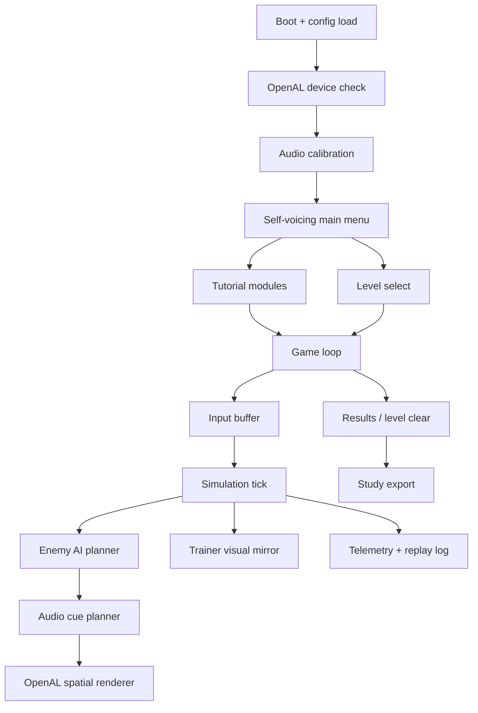

# EchoRunner — Project Masterplan and System Architecture

> Source alignment: This workplan updates the previous Sound-Maze package into **EchoRunner**, a Python + Pygame game with OpenAL spatial audio. It follows the blind-first design doctrine from the supplied Sound-Maze plan, the local-first/accessibility/research workflow from the HCI toolkit guide, and the OpenAL device/context/buffer/source/listener model from the OpenAL Programmer's Guide.

## 1. Product identity

**Project name:** EchoRunner  
**Genre:** Blind-first real-time sound-maze chase game  
**Primary platform:** Desktop Windows, macOS, Linux  
**Main implementation language:** Python 3.11+  
**Game framework:** Pygame / Pygame-CE for window, input, 2D trainer view, timing, assets, and debug overlays  
**Spatial audio engine:** OpenAL / OpenAL Soft, driven from Python through a dedicated audio backend  
**Primary player:** Blind and low-vision players using keyboard and headphones or speakers  
**Secondary users:** Trainers, HCI researchers, accessibility testers, educators, parents, sighted assistants

EchoRunner is not a visual arcade game with some sound added. It is a real-time game where sound is the main interface. The player runs through a grid maze, collects echo orbs, avoids hostile sound creatures, uses resonance cores to temporarily reverse danger, and clears levels by building a mental map from spatial audio, rhythm, speech, and repeatable landmarks.

The visual screen exists for three reasons only:

1. **Trainer view** — a sighted coach/researcher can understand what is happening.
2. **Debug view** — the development team can inspect state, AI, and audio cues.
3. **Low-vision support** — optional high-contrast visuals can support players who use residual vision.

The game must remain fully playable with the monitor off.

## 2. North-star success criteria

EchoRunner is successful when a blind player can:

- launch the game without a mouse;
- understand the first menu from self-voicing audio;
- complete a safe tutorial using only keyboard and audio;
- understand left, right, front, back, near, far, danger, reward, wall, junction, power mode, and level clear cues;
- die or fail without confusion about why it happened;
- replay instructions and calibrate audio at any time;
- play at least the first three levels with visual output disabled.

The trainer/researcher is successful when they can:

- watch the trainer dashboard;
- see current player tile, enemy tile, cue currently being played, threat level, scan output, and recent deaths/confusion;
- run a session study using local logs;
- export anonymized telemetry and questionnaire data.

## 3. Main design laws

EchoRunner follows five implementation laws:

1. **Sound is gameplay.** Spatial sound, rhythm, pitch, volume, and speech are game mechanics.
2. **Every sound answers a player question.** Where am I? What changed? What is dangerous? What can I do next?
3. **No unexplained hidden state.** Mode changes, enemy threats, and death causes must be audible and logged.
4. **Mental maps are designed, not accidental.** Levels use zones, landmarks, loops, and repeated route identities.
5. **Difficulty changes one variable at a time.** Do not increase speed, enemies, branching, and cue scarcity all in one level.

## 4. High-level system architecture



## 5. Runtime subsystems

### 5.1 `echorunner.app`
Owns app startup, config loading, dependency checks, state transitions, and shutdown.

Responsibilities:

- initialize Pygame;
- initialize OpenAL backend;
- load settings from `config/defaults.yaml` and `data/user_settings.json`;
- route between boot, calibration, menu, tutorial, level, pause, results, and study mode.

### 5.2 `echorunner.input`
Converts keyboard events into semantic player commands.

Do not let gameplay code depend directly on raw key constants. Use commands:

```text
MOVE_UP, MOVE_DOWN, MOVE_LEFT, MOVE_RIGHT,
SCAN_SHORT, SCAN_DEEP, REPEAT_LAST, HELP,
CONFIRM, BACK, PAUSE, TOGGLE_TRAINER, CALIBRATE_AUDIO
```

### 5.3 `echorunner.simulation`
Pure game state. This should be deterministic and testable without Pygame and without OpenAL.

Owns:

- tile grid;
- player position and queued direction;
- collectibles;
- enemies;
- timers;
- collisions;
- power state;
- level clear;
- death cause.

### 5.4 `echorunner.audio`
Owns all OpenAL logic, speech playback, cue priority, source pooling, audio ducking, and fallback modes.

Important rule: **Pygame mixer must not be the primary spatial audio engine.** Pygame can handle simple fallback playback, but all directional gameplay cues should come from OpenAL sources.

### 5.5 `echorunner.cues`
Translates simulation state into audio intent.

Example:

```python
CueEvent(
    cue_id="enemy_near_red",
    priority=100,
    position=(enemy.x, 0, enemy.y),
    gain=0.9,
    pitch=1.15,
    loop=False,
    reason="hunter intercept in 1.2s",
)
```

### 5.6 `echorunner.trainer_view`
Pygame-rendered visual mirror for trainer/debugging. It shows the maze, player, enemies, active cue, threat levels, and coaching prompts.

Trainer view must not become required for play.

### 5.7 `echorunner.telemetry`
Local-first logs for balancing, accessibility testing, and research.

Outputs:

```text
data/sessions/<session_id>/events.jsonl
data/sessions/<session_id>/replay.json
data/sessions/<session_id>/summary.md
data/sessions/<session_id>/anonymized_export.json
```

## 6. Data flow per frame

```text
Pygame events
→ InputMapper produces commands
→ Simulation consumes commands and advances fixed ticks
→ AI calculates enemy decisions
→ ThreatModel calculates route danger, not only Euclidean distance
→ CuePlanner ranks audio cues
→ OpenAL updates listener and source positions
→ TrainerView renders optional mirror
→ Telemetry records important events
```

Use a fixed simulation tick for fairness:

```text
simulation_tick = 60 Hz or 30 Hz
render_tick = best effort
OpenAL update = every simulation tick for moving sources, or at least 30 Hz
```

## 7. Repository target structure

```text
EchoRunner/
├── README.md
├── pyproject.toml
├── requirements.txt
├── assets/
│   ├── sprites/
│   ├── tiles/
│   ├── backgrounds/
│   └── ui/
├── audio/
│   ├── sfx/
│   ├── speech/en/
│   ├── speech/bn/
│   └── manifests/
├── levels/
├── config/
│   ├── defaults.yaml
│   ├── keybindings.yaml
│   └── audio_profiles.yaml
├── src/echorunner/
│   ├── app.py
│   ├── main.py
│   ├── state_machine.py
│   ├── input/
│   ├── simulation/
│   ├── audio/
│   ├── cues/
│   ├── trainer_view/
│   ├── telemetry/
│   └── research/
├── tests/
├── scripts/
└── docs/
```

## 8. Development milestones

### Milestone 1 — Audio boot prototype

- Pygame window opens.
- OpenAL device/context initializes.
- Headphone direction test speaks left, center, right.
- A moving sound source pans relative to the player listener.
- Menu is keyboard-only and self-voicing.

### Milestone 2 — Tutorial slice

- Small 7x7 maze.
- Player moves by keyboard.
- Wall, movement, pellet, junction, and scan cues work.
- Trainer dashboard mirrors state.
- Telemetry logs movement and cue events.

### Milestone 3 — First playable level

- One enemy with hunter behavior.
- Threat colors green/amber/red converted to audio priority.
- Power core reverses danger.
- Death explanation and replay summary.
- Level clear and score summary.

### Milestone 4 — Research-ready alpha

- Three tutorial modules.
- Three levels.
- Settings for cue density, speech speed, low-stress mode, mono mode, and headphones mode.
- Local session export.
- Basic SUS/NASA-TLX study prompts from the HCI toolkit workflow.

### Milestone 5 — Cross-OS packaged beta

- Windows executable.
- Linux AppImage or standalone folder.
- macOS app bundle or signed/notarization-ready folder.
- OpenAL Soft bundled or install-check script provided.

## 9. Definition of done

A feature is done only when:

- it works without mouse;
- it has a meaningful audio cue or speech prompt;
- it is visible in trainer/debug mode;
- it is included in local telemetry;
- it has at least one unit/integration test;
- the player can replay or ask for help if confused;
- low-vision visuals are high contrast but not required.
