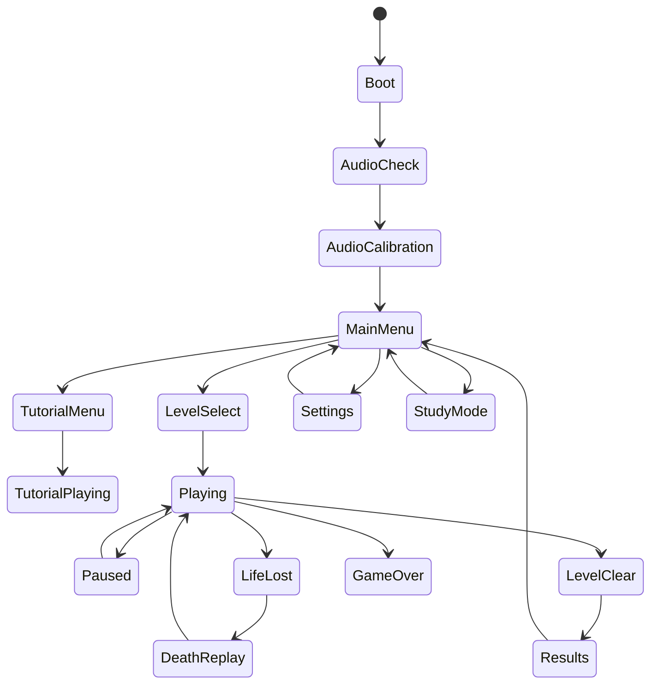

# EchoRunner Game Workflow and Behaviour Specification

> Source alignment: This workplan updates the previous Sound-Maze package into **EchoRunner**, a Python + Pygame game with OpenAL spatial audio. It follows the blind-first design doctrine from the supplied Sound-Maze plan, the local-first/accessibility/research workflow from the HCI toolkit guide, and the OpenAL device/context/buffer/source/listener model from the OpenAL Programmer's Guide.

This file describes how EchoRunner behaves from launch to shutdown. It is written as an implementation contract for designers, developers, and testers.

## 1. First launch flow

On first launch, the game must not drop the player into a silent menu. It should speak immediately.

```text
Boot
→ Load config
→ OpenAL device check
→ Speak: "Welcome to EchoRunner..."
→ Ask for headphone direction test
→ Calibrate volume
→ Offer tutorial as the first selected menu option
```

First spoken line:

```text
Welcome to EchoRunner. This game is played by listening. Use arrow keys or W A S D to move. Press Enter to choose. Press Space to scan. Press R to repeat. Press H for help. For best results, use headphones. The first option is Start Tutorial.
```

This exact line is included in `soundLibrary/speech/en/wav/first_launch_en.wav`.

## 2. Global app states



Every state must have:

- entry speech or entry cue;
- keyboard controls;
- repeat-last option;
- back option where safe;
- telemetry event.

## 3. Menu behaviour

### Main menu items

Order matters because blind users hear menus sequentially.

1. Start Tutorial
2. Continue Game
3. Level Select
4. Audio Calibration
5. Settings
6. Trainer / Research Mode
7. Quit

Controls:

```text
Up/Down: move menu selection
Enter: select
R: repeat current item
H: explain current menu
Esc: back or quit confirmation
```

Menu movement should play `menu_move.wav`. Confirm should play `menu_confirm.wav`. Back should play `menu_back.wav`. Speech should be short and interruptible.

## 4. Audio calibration flow

Calibration is mandatory on first launch and replayable from settings.

Steps:

1. Speak: "Audio calibration. You will hear left, center, and right."
2. Play left cue using OpenAL source at player-left.
3. Speak: "Left."
4. Play center cue as listener-relative.
5. Speak: "Center."
6. Play right cue using OpenAL source at player-right.
7. Speak: "Right."
8. Ask: "Did left and right sound correct? Press Enter for yes, Space to repeat, M for mono mode."

If the player chooses mono mode, the game must replace directional assumptions with spoken compass cues and different pitch/rhythm cues.

## 5. Tutorial workflow

Tutorial is not optional polish. It is the first real game feature.

### Tutorial modules

1. **Hear walls** — player walks into and beside walls. Teach `wall_knock` and corridor rhythm.
2. **Turn at junctions** — teach open directions and queued turns.
3. **Collect echo orbs** — teach pellet tick, row clear, and progress summary.
4. **Use short scan** — teach Space scan and compact route preview.
5. **Escape one enemy** — teach green/amber/red threat cues.
6. **Use resonance core** — teach power activation, frightened enemy, countdown, expiration.
7. **Play a real level** — combine all cues with safe enemy speed.

### Tutorial rule

A tutorial module should not fail the player immediately. The game should correct and retry.

Example:

```text
Player hits wall three times in module 1
→ speak: "That was a wall. Try turning right. Press R to repeat instructions."
```

## 6. Core level flow

```text
Level intro speech
→ 3-second orientation cue
→ Play begins
→ Player collects echo orbs
→ Enemies patrol/scatter
→ Timer shifts enemies to hunt/chase
→ Threat planner prioritizes cues
→ Player uses scan and memory
→ Resonance core activates power mode
→ All orbs collected
→ Level clear speech and results
```

## 7. Game goal

The player goal is:

```text
Collect every echo orb in the maze. Avoid enemies. Use resonance cores to turn danger into a short advantage. Learn the maze by sound, clear the level, and improve your route.
```

The goal should be spoken:

- first launch;
- start tutorial;
- first level intro;
- when the player presses H from gameplay.

## 8. Player movement behaviour

EchoRunner uses tile-based movement, but input must be forgiving.

### Direction queue

If the player presses a turn slightly before reaching a junction, store it.

```text
current_direction = RIGHT
queued_direction = UP
if next tile allows UP at junction:
    turn UP automatically
```

This avoids the unfair requirement of exact visual tile timing.

### Movement feedback

Each tile step may produce a low-volume movement tick. It should be subtle and removable in expert mode.

- Beginner: movement tick every tile.
- Standard: movement tick only when entering new corridor segment or collecting.
- Expert: movement tick minimal.

## 9. Junction behaviour

At each junction, the player needs immediate route information.

Beginner mode:

```text
short directional cue for each open path + spoken summary if stopped
```

Standard mode:

```text
short directional cue only; speech on scan request
```

Expert mode:

```text
landmarks and danger cues only; scan available but less verbose
```

Example scan:

```text
Left: pellets. Right: wall. Forward: enemy far. Back: safe loop.
```

## 10. Threat behaviour

Threat should be based on route danger, not just straight-line distance.

Threat categories:

```text
Green: enemy nearby but not intercepting.
Amber: enemy can intercept soon.
Red: collision likely unless player turns, powers up, or escapes.
Silent: not relevant enough to play.
```

Audio priority:

```text
death/collision > red threat > amber threat > junction > scan > pellet > ambience
```

When red threat plays, ambience and reward ticks should duck.

## 11. Life lost behaviour

A life loss must never be a generic failure beep only.

Flow:

```text
collision occurs
→ stop non-essential sources
→ play life_lost.wav
→ speak short cause: "Hunter caught you from the left corridor."
→ offer death replay: Enter to retry, R to repeat explanation, Space for replay summary
```

Death replay summary examples:

```text
"You turned right into an amber threat. The hunter was two tiles ahead. Try scanning before that junction."
```

## 12. Power mode behaviour

Power mode reverses the emotional state.

Activation:

- play `power_activate.wav`;
- speak or earcon-code "Power active";
- enemies switch to frightened state;
- enemy cues become brighter/wavering;
- player can collect enemies for bonus.

Countdown:

- at 3 seconds remaining, play `power_countdown.wav`;
- at 1 second remaining, repeat a faster warning;
- on expiry, play `power_expire.wav` and restore threat cues.

## 13. Pause behaviour

Pause must be self-voicing.

Pause menu items:

1. Resume
2. Repeat goal
3. Repeat controls
4. Audio calibration
5. Cue density
6. Restart level
7. Quit to main menu

## 14. Settings behaviour

Critical settings:

- cue density: beginner, standard, expert;
- speech speed: slow, normal, fast;
- speech language: English, Bangla draft;
- headphones mode;
- mono mode;
- low-stress mode;
- sudden-sound reduction;
- music volume;
- speech volume;
- effects volume;
- trainer view on/off;
- telemetry on/off;
- anonymized research mode.

All settings must be keyboard-accessible and self-voicing.

## 15. Study mode behaviour

Study mode is for HCI testing.

It wraps a normal play session with:

```text
consent script
participant ID
baseline audio calibration
play session
post-session prompts
SUS/NASA-TLX optional questionnaires
anonymized export
```

Keep study files local by default.

## 16. Exit behaviour

On quit, stop OpenAL sources, destroy context, close device, stop telemetry safely, and save settings.

The player should hear:

```text
Goodbye from EchoRunner. Settings saved.
```
