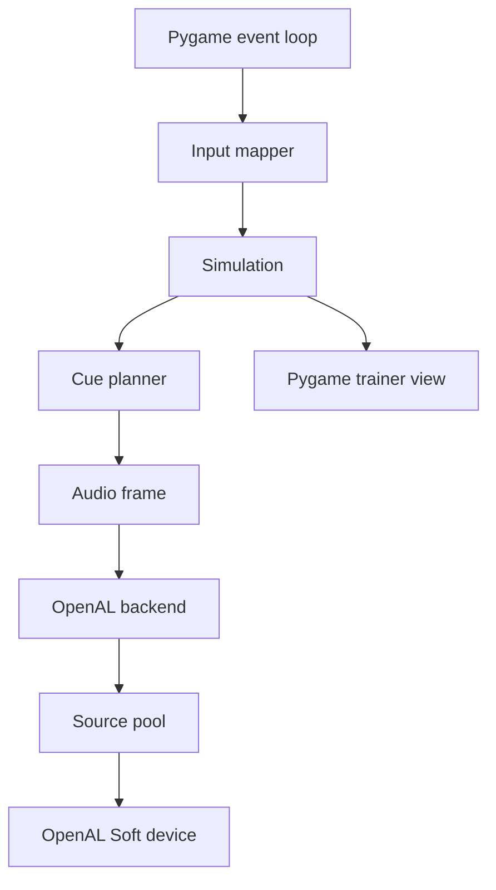

# EchoRunner OpenAL + Pygame Spatial Audio Implementation Plan

> Source alignment: This workplan updates the previous Sound-Maze package into **EchoRunner**, a Python + Pygame game with OpenAL spatial audio. It follows the blind-first design doctrine from the supplied Sound-Maze plan, the local-first/accessibility/research workflow from the HCI toolkit guide, and the OpenAL device/context/buffer/source/listener model from the OpenAL Programmer's Guide.

This is the most important technical file in the package. EchoRunner depends heavily on audio cues, so spatial/directional sound must be treated as a first-class engine subsystem.

## 1. Why OpenAL is used beside Pygame

Pygame is excellent for keyboard input, windows, timing, sprite drawing, and a trainer dashboard. But EchoRunner needs a true 3D audio model with:

- listener position;
- listener orientation;
- multiple moving sources;
- source gain/pitch;
- distance attenuation;
- left/right/front/back perception;
- source pooling and priority.

OpenAL provides this through the classic model:

```text
Device → Context → Listener + Sources → Buffers
```

A buffer holds audio data. A source plays a buffer. The listener represents the player. A source's perceived direction and distance depend on its position relative to the listener.

## 2. Integration architecture



Pygame and OpenAL should not fight over audio. Preferred policy:

```text
Pygame mixer disabled or fallback-only.
OpenAL owns all gameplay audio.
```

## 3. OpenAL startup sequence

Implementation target:

```python
class OpenALBackend:
    def start(self):
        self.device = alcOpenDevice(None)
        if not self.device:
            raise AudioBackendError("No OpenAL device")

        self.context = alcCreateContext(self.device, None)
        if not self.context:
            alcCloseDevice(self.device)
            raise AudioBackendError("Could not create OpenAL context")

        alcMakeContextCurrent(self.context)
        self.check_error("OpenAL context creation")
        self.configure_world_model()
        self.load_buffers()
        self.create_source_pool()
```

Shutdown:

```python
for source in sources:
    alSourceStop(source)
alDeleteSources(...)
alDeleteBuffers(...)
alcMakeContextCurrent(None)
alcDestroyContext(context)
alcCloseDevice(device)
```

## 4. Device enumeration

OpenAL can enumerate available playback devices. EchoRunner should use this for settings and diagnostics.

Startup should record:

```text
default playback device
available playback devices
OpenAL vendor/version/renderer if available
whether OpenAL Soft extensions are present
```

If enumeration fails, continue with default device if possible.

## 5. Buffer loading rules

Spatial gameplay SFX should be mono WAV files.

Reason: OpenAL spatializes mono sources best. Stereo files already contain left/right information and should not be used for positional world cues.

Required asset policy:

```text
SFX: 16-bit PCM WAV, mono, 22050 or 44100 Hz
Speech: 16-bit PCM WAV, mono, listener-relative
Music/ambience: optional stereo if not spatial, but keep low priority
```

## 6. Source types

EchoRunner should use source pools instead of creating/deleting sources during gameplay.

### 6.1 World spatial one-shot source

Used for:

- wall knock;
- pellet tick;
- collision warning;
- power nearby;
- warp entry/exit;
- enemy state transition.

Properties:

```text
AL_SOURCE_RELATIVE = false
AL_POSITION = world position
AL_GAIN = cue gain
AL_PITCH = cue pitch
AL_LOOPING = false
```

### 6.2 World spatial loop source

Used for:

- main enemy identity loop;
- persistent landmark hum;
- power core nearby hum.

Properties:

```text
AL_LOOPING = true
position updates every simulation tick
```

### 6.3 Listener-relative source

Used for:

- speech;
- menu sounds;
- UI confirmations;
- global warnings;
- level clear.

Properties:

```text
AL_SOURCE_RELATIVE = true
AL_POSITION = (0, 0, 0)
```

## 7. Listener update

The listener is the player.

Every simulation update:

```python
def update_listener(player):
    pos = (player.x, 0.0, player.y)
    at = direction_to_openal_at(player.direction)
    up = (0.0, 1.0, 0.0)
    alListener3f(AL_POSITION, *pos)
    alListenerfv(AL_ORIENTATION, (*at, *up))
```

Direction mapping:

```python
UP    = (0, 0, -1)
DOWN  = (0, 0,  1)
LEFT  = (-1, 0, 0)
RIGHT = (1, 0,  0)
```

## 8. Source update

For moving enemies:

```python
for enemy in enemies:
    source = enemy_sources[enemy.id]
    alSource3f(source, AL_POSITION, enemy.x, 0.0, enemy.y)
    alSourcef(source, AL_GAIN, gain_from_threat(enemy.threat))
    alSourcef(source, AL_PITCH, pitch_from_state(enemy.state))
```

Do not play all enemies loudly. The cue planner must choose which enemy is most relevant.

## 9. Distance model

Suggested model:

```python
alDistanceModel(AL_INVERSE_DISTANCE_CLAMPED)
```

Suggested source properties:

```text
AL_REFERENCE_DISTANCE = 1.0 to 2.0 tiles
AL_MAX_DISTANCE = 10.0 to 14.0 tiles
AL_ROLLOFF_FACTOR = 0.7 to 1.2
```

These are not final. They must be tuned with blind players.

## 10. Doppler policy

OpenAL supports Doppler shift using listener/source velocity and speed-of-sound parameters. EchoRunner should keep Doppler off or very subtle by default, because pitch is already used as a gameplay language.

Recommended:

```python
alDopplerFactor(0.0)
```

Only experiment with Doppler in advanced modes after the cue grammar is stable.

## 11. Threat priority over raw spatialization

OpenAL provides direction and distance, but it does not know maze walls or route danger. EchoRunner must calculate threat before choosing what to play.

Example:

```text
Enemy four tiles away behind a wall = lower priority.
Enemy six tiles away in same corridor moving toward player = higher priority.
```

The cue planner decides priority. OpenAL renders the final position.

## 12. Audio frame structure

```python
@dataclass
class AudioFrame:
    listener_position: Vec3
    listener_orientation: Orientation
    one_shots: list[CueEvent]
    loops: list[LoopUpdate]
    speech: SpeechEvent | None
    ducking: DuckingState
```

The app loop should produce one `AudioFrame` per simulation tick.

## 13. Cue event structure

```python
@dataclass
class CueEvent:
    cue_id: str
    file_id: str
    priority: int
    spatial: bool
    position: tuple[float, float, float] | None
    gain: float = 1.0
    pitch: float = 1.0
    loop: bool = False
    source_relative: bool = False
    interrupt_speech: bool = False
    reason: str = ""
```

## 14. Source pool design

Example source allocation:

```text
8 one-shot high-priority sources
8 one-shot reward/navigation sources
4 loop enemy sources
4 loop landmark sources
2 speech/menu sources
1 ambience source
```

When all one-shot sources are busy, steal the lowest-priority active source if the new cue is more important.

Never let pellet sounds block red danger.

## 15. Ducking and masking

Ducking means reducing lower-priority sound volume when important cues play.

Suggested ducking:

```text
red threat: reduce ambience/music by 12 dB and reward ticks by 6 dB
speech: reduce ambience/music by 10 dB
power countdown: reduce ambience/music by 8 dB
life lost: stop all non-essential sounds
```

## 16. Speech playback through OpenAL

Speech files should be listener-relative.

```text
AL_SOURCE_RELATIVE = true
AL_POSITION = (0, 0, 0)
```

Speech categories:

- menu narration;
- tutorial instructions;
- scan summaries;
- death explanations;
- settings confirmation;
- study prompts.

Urgent gameplay cues may interrupt or duck speech.

## 17. Mono fallback

When mono mode is enabled or headphone calibration fails, do not rely on panning.

Replace directional output with:

```text
speech: "enemy left" / "pellets forward"
pitch coding: high = forward, low = back
rhythm coding: left = two ticks, right = three ticks
compass scan summaries
```

## 18. OpenAL error handling

After every important OpenAL call during development:

```python
err = alGetError()
if err != AL_NO_ERROR:
    logger.error("OpenAL error after %s: %s", operation, err)
```

In release builds, check at batch boundaries to avoid overhead.

## 19. Fallback strategy

If OpenAL cannot start:

1. Show and speak a clear error if possible.
2. Offer non-spatial fallback mode using Pygame mixer.
3. Warn that gameplay will not fully represent intended audio.
4. Allow user to run audio diagnostics.

Fallback is for debugging and compatibility, not final blind-first quality.

## 20. Audio test scenes

Create test scenes before full gameplay:

### Test 1 — Left/right panning

A tone moves left → center → right.

### Test 2 — Front/back test

A tone moves forward → behind. If front/back is unclear on stereo headphones, reinforce with pitch or speech.

### Test 3 — Enemy approach

Enemy sound starts six tiles away, moves toward player, shifts green → amber → red.

### Test 4 — Cue masking test

Play pellets, ambience, speech, and red warning together. Verify red warning wins.

## 21. Implementation warning

Do not assume OpenAL spatialization will be equally clear on every device. Headphones, laptop speakers, desktop speakers, mono output, and Bluetooth audio all behave differently. EchoRunner must include calibration, mono fallback, and adjustable cue density.
