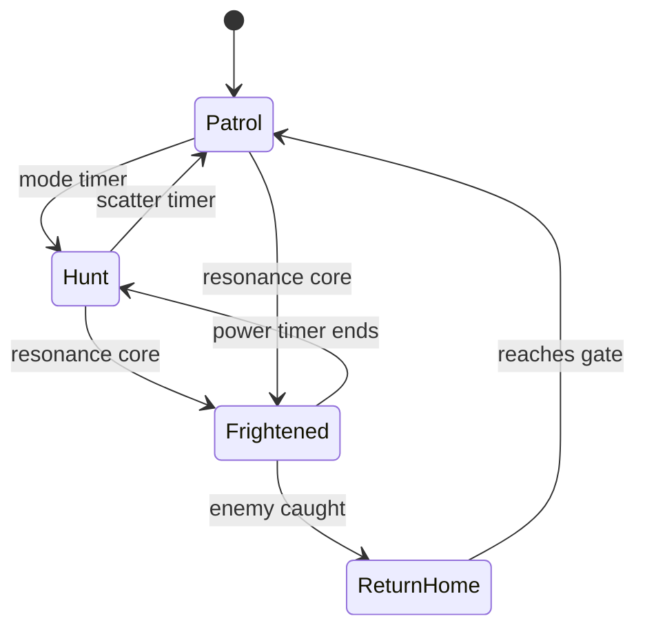

# EchoRunner Enemy AI, Fair Pressure, Telemetry, and Research Logging

> Source alignment: This workplan updates the previous Sound-Maze package into **EchoRunner**, a Python + Pygame game with OpenAL spatial audio. It follows the blind-first design doctrine from the supplied Sound-Maze plan, the local-first/accessibility/research workflow from the HCI toolkit guide, and the OpenAL device/context/buffer/source/listener model from the OpenAL Programmer's Guide.

## 1. Enemy AI design goal

Enemies should create pressure that is readable through sound. They should not feel random or unfair. Each enemy needs a clear behavior personality and audio identity.

## 2. Enemy state machine



Every state change must emit a cue.

## 3. Target logic

### Hunter

```text
target = player current tile or shortest route intercept
```

### Ambusher

```text
target = tile 2–4 steps ahead of player direction
```

### Trickster

```text
target = blend of player tile, random junction, and route pressure
```

### Coward/Guard

```text
if far: approach player
if near: retreat or guard power/route
```

## 4. AI fairness constraints

Enemies must obey:

- no teleporting near player without cue;
- no silent state change;
- no unavoidable spawn collision;
- no enemy speed increase without level intro or progression cue;
- no hidden rule changes during a level.

## 5. Threat model

Threat should be computed from route possibility.

Inputs:

```text
player tile
player direction
player speed
queued turn
enemy tile
enemy direction
enemy speed
enemy state
maze graph
nearest safe turn
power core distance
```

Outputs:

```text
threat class: silent, green, amber, red, frightened
intercept estimate
recommended player hint for death replay
source position for OpenAL
cue priority
```

## 6. Cue priority examples

```text
red hunter same corridor: priority 100
power ending in 2 seconds: priority 95
ambusher amber at next junction: priority 80
pellet tick: priority 20
landmark hum: priority 10
```

## 7. Telemetry events

Record local JSONL events:

```json
{"t": 0.0, "type": "session_start", "level": "level_01_training_loop"}
{"t": 3.2, "type": "move", "from": [1,1], "to": [2,1], "direction": "right"}
{"t": 4.1, "type": "cue", "cue_id": "junction_open_right", "priority": 50}
{"t": 9.6, "type": "threat", "enemy": "hunter", "class": "amber"}
{"t": 11.0, "type": "death", "cause": "hunter_left_corridor", "tile": [5,3]}
```

## 8. Replay system

A replay file should contain enough data to reconstruct:

- level id;
- random seed;
- input commands with timestamps;
- important simulation events;
- cue events;
- deaths and explanations.

This allows debugging and research without screen recordings.

## 9. Confusion markers

Add a trainer key for confusion marker:

```text
F8 = mark confusion
```

Record:

```json
{"t": 44.2, "type": "trainer_marker", "marker": "confusion", "note": "player asked where am I"}
```

## 10. Research study integration

The HCI toolkit workflow suggests structured local collection, optional audio notes, participant IDs, and exportable reports. EchoRunner should include a lightweight research wrapper:

```text
create participant/session ID
run consent script
start local telemetry
play tutorial/level
collect post-task short prompts
export anonymized session
```

## 11. Privacy rules

- Store local by default.
- Do not record microphone audio unless explicitly enabled.
- Use participant IDs, not real names.
- Provide anonymized export.
- Allow raw telemetry deletion.
- Explain to researchers that consent templates are not legal approval.

## 12. Balancing metrics

Important metrics:

```text
deaths per level
red warnings before death
scan usage per minute
wall collisions per minute
time stuck at junctions
power mode usage
level completion rate
tutorial retry count
cue density selected
mono/headphone mode selected
```

## 13. Fairness test queries

After playtests, answer:

- Did the player know why they died?
- Did red cue happen early enough?
- Did speech interrupt danger?
- Did scan summaries help decisions?
- Did the player build a mental map?
- Did trainer interventions become less frequent over time?

## 14. Automated fairness tests

Write tests for:

```text
enemy cannot spawn within red danger distance without transition cue
every power expiration emits warning before state changes
red threat appears before collision in same corridor
scan never says a wall is open
death replay cause matches actual collision source
cue planner never drops red threat for pellet reward
```
